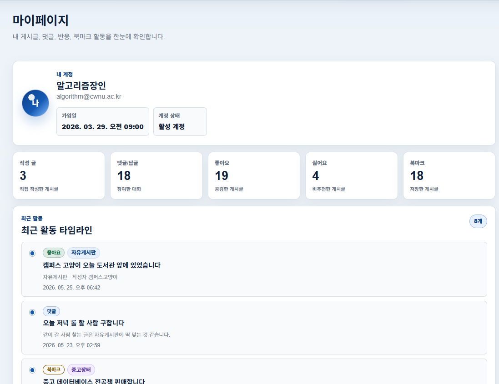

# 데이터베이스개론 과제: CWNU Community 게시판 시스템

[](https://github.com/jeongiryang/DatabaseLanguage_NodeJS_CWNU-Community/releases)


- [GitHub 저장소 바로가기](https://github.com/jeongiryang/DatabaseLanguage_NodeJS_CWNU-Community.git)
- [Vercel 배포 사이트 바로가기](https://cwnu-community.vercel.app/)
- [기능 설명서 바로가기](docs/feature-guide.md)
- [AI 활용 명시 바로가기](docs/ai-usage.md)
- [UI/UX 고도화 로드맵 바로가기](docs/ui-ux-roadmap.md)

## 기획

`CWNU Community`는 국립창원대학교 구성원을 위한 학내 커뮤니티 게시판 시스템임.

- 본 프로젝트는 3학년 1학기 소프트웨어공학 미니 프로젝트에서 TodoList 기반으로 확장했던 [CWNU Smart Portal](https://github.com/jeongiryang/todo-app-mini-project-20222017.git)과 연계되는 **DBMS 기반 커뮤니티 게시판**으로 기획함.
- 기존 Smart Portal은 학사 서비스와 주요 기능으로 이동하는 포털/입구 역할을 담당함.
- CWNU Community는 사용자가 실제로 글을 작성하고 댓글과 반응을 남길 수 있는 데이터 저장 중심 게시판 역할을 담당함.
- 두 프로젝트는 역할이 다르므로 레포지토리와 배포 프로젝트를 분리하여 관리함.
- 소프트웨어공학 과제가 평가 중인 동안에는 기존 Smart Portal 레포를 수정하지 않고, 현재 README에서는 [CWNU Smart Portal 배포 사이트](https://todo-app-mini-project-20222017.vercel.app/)와 연계 가능한 구조를 문서화함.
- Smart Portal에서 이 DB 게시판으로 연결하는 버튼은 평가 완료 후 별도 확장 작업으로 진행 예정임.

핵심 구현 방향은 다음과 같음.

- `CWNU Smart Portal`과 링크로 연계 가능한 독립 커뮤니티 서비스
- **Node.js + Express** 기반 REST API 서버
- **PostgreSQL** DBMS와 **Prisma ORM**을 활용한 데이터 모델링
- EJS 없이 **HTML/CSS/Vanilla JS**로 구성한 정적 프론트엔드
- `fetch()` 기반 API 통신
- **JWT httpOnly cookie** 기반 인증
- Vercel 배포를 고려한 `api/index.js` 서버리스 진입점과 `vercel.json` 라우팅 구조

---

## 미리보기

아래는 v1.2.0 기준 최종 구현된 CWNU Community의 대표 화면임.

### 미리보기 - CWNU Community

|  |
|:--:|
| **▲ 메인 대시보드: 요약 카드, 주요 게시판, Hot/Notice/Latest 프리뷰** |

|  |  |
|:--:|:--:|
| **▲ 검색, 최근 검색어, 표/카드 보기 전환** | **▲ 작성 가이드, 미리보기, 임시저장** |

|  |  |
|:--:|:--:|
| **▲ 상세 헤더, 반응, 댓글 이동, 추천 게시글** | **▲ 활동 타임라인과 활동 요약** |

|  |
|:--:|
| **▲ v1.2.0 다크모드 대표 화면** |

### 모바일 뷰포트

|  |  |
|:--:|:--:|
| **▲ 모바일 대시보드와 Floating 글쓰기 버튼** | **▲ 모바일 게시글 상세/반응 UI** |

---

## 목차

- [I. 서론](#i-서론)
  - [1. 개요](#1-개요)
  - [2. 프로젝트 목적과 방향성](#2-프로젝트-목적과-방향성)
  - [3. 과제 요구 조건 체크리스트](#3-과제-요구-조건-체크리스트)
  - [4. 주요 파일 및 폴더 구조](#4-주요-파일-및-폴더-구조)
- [II. 본론](#ii-본론)
  - [1. 개발 환경](#1-개발-환경)
  - [2. 시스템 구조](#2-시스템-구조)
  - [3. DB 설계](#3-db-설계)
  - [4. 주요 기능](#4-주요-기능)
  - [5. Smart Portal 연계 구조](#5-smart-portal-연계-구조)
  - [6. 주요 API 요약](#6-주요-api-요약)
  - [7. 테스트 데이터 및 검증](#7-테스트-데이터-및-검증)
- [III. 문제 해결](#iii-문제-해결)
  - [1. 문제 요약 테이블](#1-문제-요약-테이블)
  - [2. Vercel API 라우팅](#2-vercel-api-라우팅)
  - [3. Prisma/Neon migration](#3-prismaneon-migration)
  - [4. JWT cookie 배포 환경](#4-jwt-cookie-배포-환경)
  - [5. Cascade 삭제 검증](#5-cascade-삭제-검증)
  - [6. Git/migration/민감정보 관리](#6-gitmigration민감정보-관리)
- [IV. 결론](#iv-결론)
  - [1. 배운 점](#1-배운-점)
  - [2. 느낀 점](#2-느낀-점)
  - [3. 아쉬운 점 및 향후 계획](#3-아쉬운-점-및-향후-계획)
- [부록](#부록)
  - [1. 제출 문서 바로가기](#1-제출-문서-바로가기)
  - [2. 대표 증빙 캡처](#2-대표-증빙-캡처)

---

## I. 서론

### 1. 개요

| 항목 | 내용 |
|---|---|
| 이름 | 정이량 |
| 학번 | 20222017 |
| 과목명 | 데이터베이스개론 |
| 교수명 | 최도진 |
| 프로젝트명 | CWNU Community 게시판 시스템 |
| 개발 형태 | Node.js 기반 DBMS 웹 게시판 |
| DBMS | PostgreSQL |
| ORM | Prisma ORM |
| 배포 고려 환경 | Vercel |

`CWNU Community`의 개요는 다음과 같음.

- 학내 구성원이 게시글을 작성하고, 댓글과 반응 기능을 통해 소통할 수 있는 커뮤니티 게시판임.
- 전체글, 인기글, 공지사항, 자유게시판, 공부이야기, 질문게시판, 정보공유, 중고장터, 분실물 게시판 제공.
- 기존 `CWNU Smart Portal`에서 필요한 메뉴로 바로 연결할 수 있도록 URL query 구조 설계.

### 2. 프로젝트 목적과 방향성

본 프로젝트의 목적과 방향성은 다음과 같음.

- 데이터베이스개론 과제 조건에 맞게 **DBMS를 활용한 실제 웹 게시판** 구현.
- 단순 화면 구성이 아니라 사용자, 게시글, 댓글, 답글, 좋아요, 싫어요, 북마크 데이터를 **PostgreSQL**에 저장.
- **Prisma ORM**으로 데이터 관계와 제약 조건 관리.
- 기존 [CWNU Smart Portal GitHub](https://github.com/jeongiryang/todo-app-mini-project-20222017.git) 프로젝트와 연결될 수 있도록 전체 커뮤니티, 중고장터, 분실물 게시판을 URL query 기반으로 분리.
- 현재는 소프트웨어공학 과제 평가 기간을 고려하여 Smart Portal 레포는 수정하지 않고, DB 게시판 문서에서 [CWNU Smart Portal 배포 사이트](https://todo-app-mini-project-20222017.vercel.app/)를 연계 대상 프로젝트로 안내.

개발 방향은 다음과 같음.

- 과제 필수 기능을 우선 구현
- 게시글 삭제와 회원 탈퇴 시 관련 데이터가 남지 않도록 **Cascade 삭제** 설계
- 작성자 본인만 수정/삭제할 수 있도록 서버에서 권한 검증
- 제출용 기능 설명서 캡처가 가능하도록 화면 흐름을 명확히 구성
- 기존 `CWNU Smart Portal`과 레포를 합치지 않고 독립 배포 후 링크로 연동
- Smart Portal에서 DB 게시판으로 연결하는 버튼은 소프트웨어공학 과제 평가 완료 후 별도 확장 작업으로 진행

### 3. 과제 요구 조건 체크리스트

필수 요구사항과 추가 구현 기능이 섞이지 않도록, 아래 표는 과제 필수 조건 중심으로 정리함.

| 필수 요구 조건 | 상태 | 구현 내용 | 증빙 캡처 |
|---|:---:|---|---|
| Node.js 사용 | O | Node.js + Express 서버 | - |
| EJS 미사용 | O | HTML/CSS/Vanilla JS 정적 프론트 | - |
| DBMS 활용 | O | PostgreSQL 사용 | [Prisma Studio](docs/screenshots/06-database/prisma-studio-models.png) |
| ORM 또는 Promise 기반 쿼리 | O | Prisma ORM 사용 | [Prisma Studio](docs/screenshots/06-database/prisma-studio-models.png) |
| 회원가입/로그인/로그아웃 | O | `/api/auth` API | [회원가입](docs/screenshots/01-auth/register.png), [로그인](docs/screenshots/01-auth/login.png) |
| 비밀번호 암호화 | O | bcrypt hash 저장 | - |
| 쿠키 방식 로그인 유지 | O | JWT httpOnly cookie | [로그인 후 헤더](docs/screenshots/01-auth/auth-header.png) |
| 전체 글 조회 | O | `GET /api/posts` | [메인 게시판](docs/screenshots/05-pagination-sort/main-board.png) |
| 10/20/30/40/50 페이징 | O | `pageSize` 허용값 검증 | [페이징](docs/screenshots/05-pagination-sort/pagination.png) |
| 목록에서 제목/게시자/등록일/댓글 수/좋아요 수 표시 | O | 게시글 목록 테이블에 표시 | [메인 게시판](docs/screenshots/05-pagination-sort/main-board.png) |
| 좋아요순 또는 조회수순 정렬 | O | `sort=likes`, `sort=views` | [좋아요순](docs/screenshots/05-pagination-sort/sort-likes.png), [조회수순](docs/screenshots/05-pagination-sort/sort-views.png) |
| 게시글 상세 조회 | O | `GET /api/posts/:id` | [게시글 상세](docs/screenshots/02-posts/post-detail.png) |
| 게시글 내용 및 댓글 조회 | O | 상세 화면과 댓글 API | [댓글 목록](docs/screenshots/03-comments/comments.png) |
| 게시글 작성 | O | 로그인 사용자만 작성 가능 | [게시글 작성](docs/screenshots/02-posts/post-write.png) |
| 게시글 삭제 | O | 작성자 본인만 삭제 가능 | [게시글 삭제](docs/screenshots/02-posts/post-delete.png) |
| 게시글 삭제 시 댓글/좋아요 삭제 | O | Prisma cascade 삭제 | [게시글 삭제 cascade](docs/screenshots/06-database/cascade-post-delete.png) |
| 댓글 작성/삭제 | O | 로그인 사용자 작성, 작성자 본인 삭제 | [댓글 목록](docs/screenshots/03-comments/comments.png) |
| 좋아요/좋아요 취소 | O | Like 모델과 API | [반응 버튼](docs/screenshots/04-likes/reactions-bookmark.png) |
| 기능 설명서용 화면 구성 | O | 주요 기능별 화면 구성 | [기능 설명서](docs/feature-guide.md) |

기본 댓글 작성/삭제는 필수 기능으로 구현하고, 1단계 답글은 추가 구현 기능으로 확장함. 답글의 답글은 서버에서 제한하여 댓글 구조가 과도하게 깊어지지 않도록 처리함.

### 4. 주요 파일 및 폴더 구조

```txt
DatabaseLanguage_NodeJS_CWNU-Community/
|- api/                  # Vercel 서버리스 API 진입점
|  `- index.js           # Express app export
|- docs/                 # 제출 문서와 스크린샷
|  `- screenshots/       # 기능별 캡처와 원본 이미지
|- prisma/               # Prisma schema와 migration
|  |- migrations/        # DB 변경 이력
|  `- schema.prisma      # DB 모델 정의
|- public/               # 정적 프론트엔드 HTML/CSS/JS
|  |- css/
|  |  `- style.css       # 공통 UI, 다크모드, hover 스타일
|  |- js/
|  |  |- api.js          # fetch 공통 helper
|  |  |- auth.js         # 인증 UI, 테마, 비밀번호 토글
|  |  |- mypage.js       # 마이페이지 렌더링
|  |  `- posts.js        # 게시글/댓글/반응/도움말 UI
|  |- index.html         # 메인 게시판
|  |- post-detail.html   # 게시글 상세
|  |- post-write.html    # 게시글 작성/수정
|  `- mypage.html        # 마이페이지
|- scripts/              # 개발용 seed/reset 스크립트
|  `- seed-dev.js
|- server/               # Express 서버 로직
|  |- app.js             # Express app 설정과 라우팅
|  |- prisma.js          # Prisma Client 연결
|  |- controllers/       # 기능별 요청 처리
|  |- middlewares/       # 인증 middleware
|  |- routes/            # REST API route
|  `- utils/             # JWT, cookie helper
|- .env.example          # 환경변수 예시
|- README.md             # 보고서형 프로젝트 문서
|- server.js             # 로컬 실행 진입점
`- vercel.json           # Vercel API rewrite 설정
```

---

## II. 본론

### 1. 개발 환경

| 구분 | 사용 기술 |
|---|---|
| Runtime | Node.js |
| Server | Express.js |
| DBMS | PostgreSQL |
| ORM | Prisma ORM |
| 인증 | JWT + httpOnly cookie |
| 비밀번호 암호화 | bcrypt |
| Frontend | HTML, CSS, Vanilla JavaScript |
| API 호출 | `fetch()` |
| 배포 고려 | Vercel |

서버 사이드 템플릿 엔진은 사용하지 않음. 화면은 `public/` 디렉터리의 정적 HTML, CSS, Vanilla JS로 구성하고, 데이터는 REST API를 `fetch()`로 호출하여 처리함.

### 2. 시스템 구조

```txt
Browser
  |
  | HTML/CSS/Vanilla JS
  | fetch()
  v
Express REST API
  |
  | Prisma Client
  v
PostgreSQL
```

- 로컬 환경에서는 `server.js`가 Express 앱 실행을 담당함.
- Vercel 배포 환경에서는 `api/index.js`가 서버리스 Express 진입점 역할을 담당함.
- `vercel.json`의 rewrite 설정으로 `/api` 요청을 Express 앱에 전달함.
- 실제 배포 URL은 `https://cwnu-community.vercel.app/`로 구성함.
- Neon PostgreSQL과 **Prisma ORM**을 연동하여 배포 환경에서도 실제 DB 기반 기능이 동작하도록 구성함.
- HTTPS 배포 환경에서는 `COOKIE_SECURE=true`를 적용하여 **JWT httpOnly cookie** 인증이 유지되도록 설정함.

### 3. DB 설계

- 관계형 데이터베이스의 특성을 살리기 위해 사용자, 게시글, 댓글, 반응 데이터를 명확한 관계로 분리함.
- 중복 반응을 막기 위한 unique 제약 적용.
- 게시글 삭제와 회원 탈퇴 시 관련 데이터가 남지 않도록 cascade 정책 적용.

| 모델 | 역할 | 주요 필드 | 관계 및 제약 |
|---|---|---|---|
| User | 사용자 계정 | `email`, `nickname`, `passwordHash` | Post, Comment, Like, Dislike, Bookmark와 1:N |
| Post | 게시글 | `title`, `content`, `category`, `isAnonymous`, `viewCount` | User에 속함, Comment/Like/Dislike/Bookmark 보유 |
| Comment | 댓글/답글 | `content`, `parentId`, `isAnonymous` | Post/User에 속함, `parentId`로 1단계 답글 관리 |
| Like | 좋아요 | `postId`, `userId` | `postId + userId` unique |
| Dislike | 싫어요 | `postId`, `userId` | `postId + userId` unique |
| Bookmark | 북마크 | `postId`, `userId` | `postId + userId` unique |

#### 삭제 및 반응 처리 정책

| 삭제 상황 | 처리 |
|---|---|
| 게시글 삭제 | 댓글, 답글, 좋아요, 싫어요, 북마크 cascade 삭제 |
| 회원 탈퇴 | 작성 게시글, 댓글/답글, 좋아요, 싫어요, 북마크 삭제 |
| 부모 댓글 삭제 | 연결된 답글 삭제 |
| 좋아요/싫어요 전환 | 반대 반응 삭제 후 현재 반응 생성 |

#### DB 설계 증빙 캡처

| 증빙 항목 | 캡처 |
|---|---|
| Prisma Studio 모델 확인 | [Prisma Studio](docs/screenshots/06-database/prisma-studio-models.png) |
| seed 게시글 데이터 | [seed 게시글 데이터](docs/screenshots/06-database/seed-board-data.png) |
| 게시글 삭제 cascade | [게시글 삭제 cascade](docs/screenshots/06-database/cascade-post-delete.png) |
| 회원 탈퇴 cascade | [회원 탈퇴 cascade](docs/screenshots/06-database/cascade-user-delete.png) |

### 4. 주요 기능

필수 구현 기능은 과제 요구사항을 기준으로 정리하고, 추가 구현 기능은 실제 커뮤니티 서비스에 가까운 사용성을 제공하기 위해 확장한 항목임.

#### 4-1. 필수 구현 기능

| 영역 | 기능 | 구현 내용 |
|---|---|---|
| 인증 | 회원가입/로그인/로그아웃 | JWT httpOnly cookie 기반 인증 |
| 보안 | 비밀번호 암호화 | bcrypt hash 저장 |
| 게시글 | 목록/상세/작성/삭제 | Prisma 기반 CRUD, 작성자 삭제 권한 검증 |
| 댓글 | 댓글 작성/삭제 | 로그인 사용자 작성, 작성자 본인 삭제 |
| 좋아요 | 좋아요/취소 | Like 모델, `postId + userId` unique로 중복 방지 |
| 목록 | 페이징/정렬 | 10~50개 단위, 좋아요순/조회수순 지원 |
| DB | DBMS/ORM | PostgreSQL + Prisma ORM |

#### 4-2. 추가 구현 기능

| 영역 | 기능 | 설명 |
|---|---|---|
| 사용자 | 닉네임 변경/회원 탈퇴 | 마이페이지에서 계정 관리, 탈퇴 시 관련 데이터 정리 |
| 게시글 | 수정/익명/공유 | 수정일 표시, 익명 작성, 상세 링크 복사 |
| 게시판 | 공지사항/인기글/카테고리 | Smart Portal 연계 URL 지원 |
| 댓글 | 답글/수정/익명 | 1단계 답글, 답글의 답글 제한, 익명 댓글/답글 |
| 반응 | 싫어요/북마크 | 좋아요와 싫어요 상호 전환, 게시글 저장 |
| UX | 다크모드/도움말/hover/footer/모바일 최적화 | 사용자 편의성과 제출 문서 완성도 강화, 모바일 뷰포트에서 주요 화면이 깨지지 않도록 반응형 레이아웃 적용 |
| 데이터 | seed-dev | 테스트용 사용자, 게시글, 댓글, 반응 데이터 자동 생성 |

#### 게시판 URL 구조

```txt
/                   전체글
/?board=hot         인기글
/?board=notice      공지사항
/?category=free     자유게시판
/?category=study    공부이야기
/?category=question 질문게시판
/?category=info     정보공유
/?category=market   중고장터
/?category=lost     분실물
```

인기글은 기존 데이터만 사용하여 다음 점수 기준으로 정렬함.

```txt
hotScore = viewCount + likeCount * 10 + commentCount * 5 - dislikeCount * 3
```

### 5. Smart Portal 연계 구조

- 본 프로젝트는 기존 `CWNU Smart Portal`의 확장 서비스로 설계함.
- 소프트웨어공학 과제 평가 기간에는 기존 포털 레포를 수정하지 않기 위해, 현재는 DB 게시판 문서에서 Smart Portal을 연계 대상 프로젝트로 안내하는 방식으로 정리함.
- 두 프로젝트는 하나의 레포로 합치지 않음.
- `CWNU Smart Portal`은 기존 포털 프로젝트로 유지하고, `CWNU Community`는 데이터베이스개론 과제용 독립 레포와 독립 배포 프로젝트로 운영함.
- DB 게시판에서는 기존 Smart Portal 배포 사이트로 이동하는 외부 링크를 제공할 수 있음.
- Smart Portal에서 CWNU Community로 연결하는 버튼은 소프트웨어공학 과제 평가 완료 후 별도 확장 작업으로 진행 예정임.

| 연계 대상 | 연결 방향 | URL |
|---|---|---|
| DB 게시판 -> Smart Portal | 외부 링크 제공 가능 | `https://todo-app-mini-project-20222017.vercel.app/` |
| Smart Portal -> 전체 커뮤니티 | 평가 완료 후 확장 예정 | `/` |
| Smart Portal -> 공지사항 | 평가 완료 후 확장 예정 | `/?board=notice` |
| Smart Portal -> 인기글 | 평가 완료 후 확장 예정 | `/?board=hot` |
| Smart Portal -> 중고장터 | 평가 완료 후 확장 예정 | `/?category=market` |
| Smart Portal -> 분실물 | 평가 완료 후 확장 예정 | `/?category=lost` |

### 6. 주요 API 요약

대표 API 중심 요약임. 전체 API 구성은 `server/routes/` 디렉터리에서 확인 가능함.

#### Auth API

| Method | Endpoint | 설명 |
|---|---|---|
| POST | `/api/auth/register` | 회원가입 |
| POST | `/api/auth/login` | 로그인 |
| POST | `/api/auth/logout` | 로그아웃 |
| GET | `/api/auth/me` | 현재 사용자 조회 |
| PATCH | `/api/auth/me` | 닉네임 변경 |
| DELETE | `/api/auth/me` | 회원 탈퇴 |
| GET | `/api/auth/me/activity` | 마이페이지 활동 조회 |

#### Posts API

| Method | Endpoint | 설명 |
|---|---|---|
| GET | `/api/posts` | 게시글 목록, 검색, 정렬, 페이징 |
| GET | `/api/posts/:id` | 게시글 상세 조회 |
| POST | `/api/posts` | 게시글 작성 |
| PUT | `/api/posts/:id` | 게시글 수정 |
| DELETE | `/api/posts/:id` | 게시글 삭제 |

#### Comments API

| Method | Endpoint | 설명 |
|---|---|---|
| GET | `/api/posts/:postId/comments` | 댓글/답글 조회 |
| POST | `/api/posts/:postId/comments` | 댓글/답글 작성 |
| PUT | `/api/comments/:id` | 댓글/답글 수정 |
| DELETE | `/api/comments/:id` | 댓글/답글 삭제 |

#### Reactions API

| Method | Endpoint | 설명 |
|---|---|---|
| POST | `/api/posts/:postId/like` | 좋아요 |
| DELETE | `/api/posts/:postId/like` | 좋아요 취소 |
| POST | `/api/posts/:postId/dislike` | 싫어요 |
| DELETE | `/api/posts/:postId/dislike` | 싫어요 취소 |
| POST | `/api/posts/:postId/bookmark` | 북마크 |
| DELETE | `/api/posts/:postId/bookmark` | 북마크 취소 |

### 7. 테스트 데이터 및 검증

#### 7-1. 로컬 실행 순서

- 로컬 실행은 `npm run dev`와 `http://localhost:3000` 접속을 기준으로 확인함.
- 배포 환경은 Vercel, `api/index.js`, `vercel.json`, Neon PostgreSQL, `COOKIE_SECURE=true` 설정을 기준으로 별도 구성함.

| 단계 | 명령 / 내용 |
|---:|---|
| 1 | `npm install` |
| 2 | `.env.example`을 참고해 `.env` 생성 |
| 3 | `npm run prisma:generate` |
| 4 | `npx prisma validate` |
| 5 | `npm run dev` |
| 6 | `http://localhost:3000` 접속 |

- `.env`에는 `DATABASE_URL`, `DIRECT_URL`, `JWT_SECRET`, `NODE_ENV`, `PORT`, `COOKIE_SECURE`가 필요함.
- 실제 환경변수 값은 README와 제출 문서에 작성하지 않음.
- 신규 개발 DB를 준비하는 경우 `npx prisma migrate dev`로 migration을 적용한 뒤 실행함.

#### Prisma Studio

| 항목 | 내용 |
|---|---|
| 실행 명령 | `npx prisma studio` |
| 기본 접속 주소 | `http://localhost:5555` |
| 확인 가능 데이터 | User, Post, Comment, Like, Dislike, Bookmark |
| 주의 사항 | 현재 `.env`에 연결된 DB 기준으로 동작하므로 운영 DB 연결 상태에서는 데이터 수정/삭제에 주의함 |

#### 7-2. seed 데이터

> 주의: `npm run db:seed:dev -- --confirm`은 현재 연결된 DB의 기존 데이터를 삭제하고 개발용 더미 데이터를 다시 생성합니다. 운영 DB에 연결된 `.env` 상태에서는 실행하지 않아야 합니다.

| 항목 | 내용 |
|---|---|
| 실행 명령 | `npm run db:seed:dev -- --confirm` |
| production 차단 | `NODE_ENV=production`이면 실행 중단 |
| confirm 요구 | `--confirm` 없으면 실행 중단 |
| 생성 규모 | 사용자 10명, 게시글 49개, 댓글 148개, 답글 62개, 좋아요 224개, 싫어요 41개, 북마크 192개 |
| 카테고리별 게시글 | `notice`, `free`, `study`, `question`, `info`, `market`, `lost` 각 7개 |
| 생성 데이터 | 사용자, 카테고리별 게시글, 댓글/답글, 좋아요/싫어요, 북마크 |
| 데이터 구성 | v1.2.0 UI/UX 시연을 고려한 메인 대시보드, 인기글, 공지사항, 최근글, 검색, 마이페이지 활동 데이터 포함 |
| 시연 포인트 | 익명 게시글/댓글/답글, 수정됨 표시, 검색어 하이라이트용 제목, 인기글 TOP 3, 활동 타임라인용 반응 데이터 포함 |
| 데이터 초기화 | 기존 데이터를 삭제한 뒤 더미 데이터 생성 |
| 민감정보 보호 | DB URL, JWT secret 등 민감 환경변수 값 미출력 |
| 증빙 캡처 | [seed 게시글 데이터](docs/screenshots/06-database/seed-board-data.png) |

#### 7-3. 테스트 계정

seed 실행 후 사용할 수 있는 테스트 계정임. 모든 계정의 비밀번호는 `test1234!`로 통일함.

대표 시연 계정은 `assignment@cwnu.ac.kr` / `과제폭격기`임. 이 계정은 작성 글, 댓글/답글, 좋아요, 싫어요, 북마크, 익명 활동이 포함되어 마이페이지 대시보드와 활동 타임라인 확인에 적합함.

| 이메일 | 닉네임 |
|---|---|
| `algorithm@cwnu.ac.kr` | 알고리즘장인 |
| `library@cwnu.ac.kr` | 새벽도서관 |
| `potato@cwnu.ac.kr` | 코딩하는감자 |
| `campuscat@cwnu.ac.kr` | 캠퍼스고양이 |
| `dbmaster@cwnu.ac.kr` | DB마스터 |
| `assignment@cwnu.ac.kr` | 과제폭격기 |
| `hello543@cwnu.ac.kr` | hello543 |
| `quietroom@cwnu.ac.kr` | 조용한열람실 |
| `sparrow@cwnu.ac.kr` | 버그잡는참새 |
| `frontend@cwnu.ac.kr` | 프론트는어려워 |

#### 7-4. 기본 검증 명령

| 검증 항목 | 명령 |
|---|---|
| Prisma schema 검증 | `npx prisma validate` |
| auth.js 문법 검사 | `node --check public/js/auth.js` |
| posts.js 문법 검사 | `node --check public/js/posts.js` |
| mypage.js 문법 검사 | `node --check public/js/mypage.js` |
| Health check | `GET /api/health` |

---

## III. 문제 해결

### 1. 문제 요약 테이블

| 문제 | 원인 | 해결 |
|---|---|---|
| Vercel에서 하위 API 경로 라우팅 필요 | Express 앱을 서버리스 함수로 실행해야 함 | `vercel.json`에서 `/api`와 `/api/*`를 `api/index.js`로 rewrite |
| Prisma와 Neon 연결 URL 분리 | pooled connection과 direct connection 용도가 다름 | `DATABASE_URL`, `DIRECT_URL`을 분리하여 사용 |
| 배포 환경에서 인증 쿠키 저장 문제 | HTTPS 환경에서는 secure cookie 설정 필요 | `NODE_ENV=production`, `COOKIE_SECURE=true` 사용 |
| 게시글 삭제 시 관련 데이터 잔존 가능성 | 댓글, 답글, 반응, 북마크가 관계로 연결됨 | Prisma relation에 cascade 삭제 적용 |
| 회원 탈퇴 시 사용자 활동 데이터 정리 필요 | 사용자가 작성/반응한 데이터가 여러 테이블에 분산됨 | transaction과 cascade 삭제를 함께 사용 |
| 좋아요와 싫어요 동시 적용 가능성 | Like와 Dislike가 별도 테이블 | 반대 반응 삭제 후 현재 반응 생성 |
| 답글의 답글 생성 가능성 | Comment self relation만으로는 깊이 제한이 부족함 | parent 댓글의 `parentId`를 검사해 1단계까지만 허용 |
| 민감정보 노출 위험 | `.env` 또는 콘솔 출력 관리 필요 | `.env` 미커밋, `.env.example` 제공, seed 출력 제한 |
| Windows 환경 Prisma 파일 잠금 | 실행 중인 Node 프로세스가 Prisma Client 파일을 잡을 수 있음 | 서버 종료 후 generate/migrate 실행, 필요 시 Node 프로세스 정리 |

- 아래 하위 섹션에서는 실제 구현 과정에서 중요했던 기술적 판단을 정리함.
- 주요 판단 대상: 배포, migration, 인증 cookie, 삭제 정책, 민감정보 관리.

### 2. Vercel API 라우팅

- Vercel 서버리스 Express 진입점은 `api/index.js`임.
- `vercel.json`에서 `/api`와 `/api/*` 요청을 Express 앱으로 전달함.
- 실제 배포 사이트는 `https://cwnu-community.vercel.app/`임.
- 배포 후 `/api/health`, 로그인, 게시글 작성, 댓글/반응 기능을 확인할 수 있도록 구성함.

```txt
api/index.js
```

```json
{
  "rewrites": [
    {
      "source": "/api",
      "destination": "/api/index.js"
    },
    {
      "source": "/api/(.*)",
      "destination": "/api/index.js"
    }
  ]
}
```

- 정적 HTML/CSS/JS 파일은 `public/` 디렉터리를 통해 제공함.

#### Vercel 배포 환경변수

Vercel Project Settings의 Environment Variables에 아래 변수명을 등록함. 실제 값은 README나 제출 문서에 작성하지 않음.

| 변수 | 설정 |
|---|---|
| `DATABASE_URL` | Prisma Client용 PostgreSQL 연결 URL |
| `DIRECT_URL` | Prisma migration용 직접 연결 URL |
| `JWT_SECRET` | JWT 서명용 비밀키 |
| `NODE_ENV` | `production` |
| `COOKIE_SECURE` | `true` |

#### Vercel 배포 절차

| 단계 | 내용 |
|---|---|
| 1 | Vercel에 GitHub 저장소 연결 |
| 2 | Vercel 환경변수 등록 |
| 3 | PostgreSQL DB 준비 |
| 4 | `npx prisma migrate deploy`로 migration 적용 |
| 5 | Vercel 배포 실행 |
| 6 | 배포 후 `/api/health` 확인 |
| 7 | 회원가입/로그인 cookie 동작 확인 |
| 8 | 게시글 작성, 댓글, 좋아요/싫어요, 북마크 기능 확인 |

Prisma Client는 `package.json`의 `postinstall` 스크립트로 생성함.

```json
"postinstall": "prisma generate"
```

### 3. Prisma/Neon migration

- Neon PostgreSQL 환경에서는 애플리케이션이 사용하는 연결 URL과 migration에 사용하는 직접 연결 URL을 분리하는 것이 안정적임.
- `DATABASE_URL`은 Prisma Client query에 사용함.
- `DIRECT_URL`은 migration을 위한 직접 연결에 사용함.

```txt
DATABASE_URL
DIRECT_URL
```

| 환경 | 명령 | 목적 |
|---|---|---|
| 개발 | `npx prisma migrate dev` | migration 생성 및 개발 DB 적용 |
| 배포 | `npx prisma migrate deploy` | 생성된 migration을 운영 DB에 적용 |
| 공통 | `npm run prisma:generate` | Prisma Client 생성 |

### 4. JWT cookie 배포 환경

- 인증 토큰은 localStorage나 sessionStorage에 저장하지 않고 **httpOnly cookie**에만 저장함.
- 배포 환경에서는 HTTPS를 기준으로 secure cookie 사용.
- 브라우저 JavaScript에서 토큰을 직접 읽을 수 없도록 하여 토큰 노출 위험을 줄임.

```txt
NODE_ENV=production
COOKIE_SECURE=true
```

### 5. Cascade 삭제 검증

게시글 삭제 시 함께 삭제되어야 하는 데이터는 다음과 같음.

- 댓글
- 답글
- 좋아요
- 싫어요
- 북마크

회원 탈퇴 시 정리되어야 하는 데이터는 다음과 같음.

- 탈퇴 사용자가 작성한 게시글
- 탈퇴 사용자가 작성한 댓글/답글
- 탈퇴 사용자가 누른 좋아요
- 탈퇴 사용자가 누른 싫어요
- 탈퇴 사용자가 저장한 북마크
- 사용자 계정

- 서버에서는 프론트에서 전달한 userId를 신뢰하지 않음.
- 인증 미들웨어에서 확인한 현재 로그인 사용자 기준으로 삭제 처리.

### 6. Git/migration/민감정보 관리

- `.env`는 커밋하지 않음.
- `.env.example`만 제공함.
- migration 파일은 커밋 대상으로 관리함.
- 실제 DB URL과 JWT secret은 README, 캡처, 제출 문서에 작성하지 않음.
- seed 스크립트는 production 환경에서 실행되지 않도록 차단함.
- 기능 단위로 커밋하여 migration과 코드 변경 이력을 추적할 수 있게 관리함.

---

## IV. 결론

### 1. 배운 점

- **RDBMS 관계 설계**가 단순 CRUD보다 중요함을 확인함.
- 게시글, 댓글, 답글, 좋아요, 싫어요, 북마크처럼 서로 연결된 데이터는 테이블 구조뿐 아니라 unique 제약, cascade 삭제, 서버 권한 검증을 함께 고려해야 안정적으로 동작함.
- **Prisma migration**을 사용하면서 개발 DB와 배포 DB의 schema를 일관되게 관리하는 방법을 익힘.
- **Vercel 배포 환경**을 고려하면서 서버리스 API 라우팅, Prisma Client 생성, **httpOnly cookie 인증**의 secure 옵션을 함께 학습함.
- Git 브랜치와 커밋 관리 측면에서는 기능이 많아질수록 작은 단위의 변경 기록과 회귀 점검이 중요함을 확인함.

### 2. 느낀 점

- 초기에는 회원가입, 로그인, 게시글 작성 중심의 필수 기능부터 구현함.
- 기능이 늘어날수록 데이터 관계와 검증 로직의 중요성이 커짐.
- 회원 탈퇴, 게시글 삭제, 좋아요/싫어요 상호 전환처럼 여러 테이블이 동시에 영향을 받는 기능은 화면보다 서버 로직이 더 중요함.
- 다크모드, 도움말 투어, 마이페이지, footer처럼 사용자 경험을 개선하는 기능을 추가하면서 과제 제출용 프로젝트도 실제 서비스처럼 정리할 수 있음을 확인함.
- 기능이 많아질수록 회귀 테스트와 문서화가 중요함.
- AI 도구를 활용하더라도 최종 동작 확인과 문서 검토는 사람이 책임져야 함.

### 3. 아쉬운 점 및 향후 계획

향후 개선할 수 있는 부분은 다음과 같음.

- 이미지 업로드 기능
- 신고 및 관리자 기능
- 알림 기능
- 게시글 검색 조건 세분화
- Smart Portal에서 CWNU Community로 이동하는 버튼 연동
- 기능 설명서 고도화
- 모바일 화면 세부 UI 개선

---

## 부록

### 1. 제출 문서 바로가기

- [기능 설명서 바로가기](docs/feature-guide.md)
- [AI 활용 명시 문서 바로가기](docs/ai-usage.md)
- [UI/UX 고도화 로드맵 바로가기](docs/ui-ux-roadmap.md)

### 2. 대표 증빙 캡처

#### 인증 / 회원 기능

|  |  |
|:--:|:--:|
| **▲ 테스트 계정 로그인 화면** | **▲ 로그인 후 계정 요약** |

#### 게시글 / 댓글 기능

|  |  |
|:--:|:--:|
| **▲ v1.2.0 상세 헤더와 메타 정보** | **▲ 댓글과 1단계 답글** |

#### 반응 / 마이페이지

|  |  |
|:--:|:--:|
| **▲ 좋아요 · 싫어요 · 북마크 · 공유** | **▲ 마이페이지 대시보드** |

#### DB 검증

|  |  |
|:--:|:--:|
| **▲ Prisma Studio 모델 확인** | **▲ 게시글 삭제 cascade 검증** |

#### UI/UX

|  |  |
|:--:|:--:|
| **▲ v1.2.0 다크모드 화면** | **▲ Hot / Notice / Latest 프리뷰 패널** |

#### 모바일 최적화

|  |  |
|:--:|:--:|
| **▲ 모바일 대시보드와 FAB** | **▲ 모바일 상세/반응 UI** |
