# CWNU Community 기능 설명서

데이터베이스개론 과제 제출용 기능 설명서임. 본 문서는 `DatabaseLanguage_NodeJS_CWNU-Community` 프로젝트의 페이지별 기능, 동작 방식, 관련 API/DB, 캡처 위치, 검증 내용을 정리함. 현재 문서는 v1.2.0 기준 UI/UX 확장 기능과 v2.0.0 후보 계정 구조 리팩터링, 최종 시연용 seed 데이터 구성을 함께 반영함.

> 이 문서는 `docs/feature-guide.md`에 위치하므로, 이미지 경로는 `docs` 폴더 기준 상대경로인 `./screenshots/...` 형식으로 작성함.

## 목차

- [1. 프로젝트 개요](#1-프로젝트-개요)
- [2. 기술 스택](#2-기술-스택)
- [3. DBMS/ORM 사용 설명](#3-dbmsorm-사용-설명)
- [4. 회원가입 / 로그인 / 로그아웃](#4-회원가입--로그인--로그아웃)
- [5. 비밀번호 보기 / 닉네임 변경 / 비밀번호 변경 / 회원 탈퇴](#5-비밀번호-보기--닉네임-변경--비밀번호-변경--회원-탈퇴)
- [6. 게시글 목록 / 게시판 / 공지사항 / 인기글](#6-게시글-목록--게시판--공지사항--인기글)
- [7. 검색 / 정렬 / 페이징](#7-검색--정렬--페이징)
- [8. 게시글 작성 / 상세 / 수정 / 삭제](#8-게시글-작성--상세--수정--삭제)
- [9. 댓글 / 답글 / 댓글 수정 / 익명 댓글](#9-댓글--답글--댓글-수정--익명-댓글)
- [10. 좋아요 / 싫어요 / 북마크](#10-좋아요--싫어요--북마크)
- [11. 마이페이지](#11-마이페이지)
- [12. 공유 링크](#12-공유-링크)
- [13. 도움말 투어](#13-도움말-투어)
- [14. 다크모드 / UI 개선](#14-다크모드--ui-개선)
- [15. 개발용 seed 데이터](#15-개발용-seed-데이터)
- [16. DB cascade 삭제 검증](#16-db-cascade-삭제-검증)
- [17. AI 활용 명시](#17-ai-활용-명시)
- [18. 모바일 뷰포트 최적화](#18-모바일-뷰포트-최적화)
- [19. v1.2.0 UI/UX 확장 정리](#19-v120-uiux-확장-정리)
- [20. 결론](#20-결론)

---

## 1. 프로젝트 개요

### 기능 설명

`CWNU Community`는 국립창원대학교 구성원을 위한 학내 커뮤니티 게시판 시스템임. 기존 `CWNU Smart Portal`의 확장 서비스로 기획했으나, 데이터베이스개론 과제 제출을 위해 별도 레포지토리와 별도 배포 프로젝트로 구성함.

### 동작 방식

- 사용자는 정적 HTML 화면에서 게시글, 댓글, 반응 기능을 사용함.
- 프론트엔드는 `fetch()`로 REST API를 호출함.
- 서버는 Express에서 요청을 처리하고 Prisma Client로 PostgreSQL에 접근함.
- 인증은 JWT를 httpOnly cookie에 저장하는 방식으로 유지함.

### 관련 API 또는 DB

| 구분 | 내용 |
|---|---|
| 서버 | Node.js + Express |
| DBMS | PostgreSQL |
| ORM | Prisma ORM |
| 인증 | JWT httpOnly cookie |
| 주요 DB 모델 | User, Post, Comment, Like, Dislike, Bookmark |

### 관련 코드

관련 파일: `server/app.js`

```js
app.use(express.json());
app.use(express.urlencoded({ extended: true }));
app.use(cookieParser());

app.use(express.static(path.join(__dirname, "..", "public")));

app.get("/api/health", (req, res) => {
  res.json({
    status: "ok",
    service: "DatabaseLanguage_NodeJS_CWNU-Community",
  });
});

app.use("/api/auth", authRoutes);
app.use("/api/posts", postRoutes);
app.use("/api", commentRoutes);
app.use("/api", likeRoutes);
app.use("/api", dislikeRoutes);
app.use("/api", bookmarkRoutes);
```

관련 파일: `api/index.js`

```js
const app = require("../server/app");

module.exports = app;
```

### 관련 화면

- `public/index.html`
- `public/login.html`
- `public/register.html`
- `public/post-detail.html`
- `public/post-write.html`
- `public/mypage.html`

|  |
|:--:|
| **▲ v1.2.0 메인 커뮤니티 대시보드** |

### 검증 내용

- `/api/health`가 정상 응답하는지 확인함.
- 메인 페이지에서 게시글 목록 표시 여부 확인.
- 로그인/비로그인 상태에서 헤더 표시가 달라지는지 확인함.

---

## 2. 기술 스택

### 기능 설명

프로젝트는 Node.js 기반 서버와 정적 프론트엔드로 구성함. EJS는 사용하지 않고 HTML/CSS/Vanilla JS와 REST API 호출 방식으로 구현함.

### 동작 방식

| 영역 | 사용 기술 | 설명 |
|---|---|---|
| Runtime | Node.js | 서버 실행 환경 |
| Server | Express.js | REST API와 정적 파일 제공 |
| DBMS | PostgreSQL | 사용자, 게시글, 댓글, 반응 데이터 저장 |
| ORM | Prisma ORM | DB 모델과 query 관리 |
| Auth | JWT + httpOnly cookie | 로그인 유지 |
| Password | bcrypt | 비밀번호 hash 저장 |
| Frontend | HTML/CSS/Vanilla JS | EJS 없이 정적 화면 구성 |
| API | `fetch()` | 클라이언트에서 REST API 호출 |

### 관련 API 또는 DB

- `server/app.js`: Express 앱 설정
- `api/index.js`: Vercel 서버리스 진입점
- `server/prisma.js`: Prisma Client 연결
- `prisma/schema.prisma`: DB 모델 정의

### 관련 코드

관련 파일: `package.json`

```json
"scripts": {
  "dev": "nodemon server.js",
  "start": "node server.js",
  "prisma:generate": "prisma generate",
  "prisma:migrate": "prisma migrate dev",
  "prisma:studio": "prisma studio",
  "db:seed:dev": "node scripts/seed-dev.js",
  "postinstall": "prisma generate"
}
```

관련 파일: `server/prisma.js`

```js
const { PrismaClient } = require("@prisma/client");

const prisma = new PrismaClient();

module.exports = prisma;
```

### 관련 화면

- 전체 HTML 페이지
- 전체 JavaScript 파일


### 검증 내용

- `npm install` 후 의존성이 설치 여부 확인.
- `npm run prisma:generate` 정상 실행 여부 확인.
- `npm run dev`로 로컬 서버 실행 여부 확인.

---

## 3. DBMS/ORM 사용 설명

### 기능 설명

PostgreSQL을 DBMS로 사용하고 Prisma ORM을 통해 모델, relation, unique 제약, cascade 삭제 정책을 관리함.

### 동작 방식

- Prisma datasource는 `DATABASE_URL`과 `DIRECT_URL` 환경변수를 사용함.
- `DATABASE_URL`은 애플리케이션 query에 사용함.
- `DIRECT_URL`은 migration을 위한 직접 연결에 사용함.
- Prisma migration 파일은 `prisma/migrations/`에 보관함.

### 관련 API 또는 DB

| 모델 | 역할 | 주요 관계 |
|---|---|---|
| User | 사용자 계정 | Post, Comment, Like, Dislike, Bookmark와 1:N |
| Post | 게시글 | User에 속하고 Comment, Like, Dislike, Bookmark 보유 |
| Comment | 댓글/답글 | Post/User에 속하고 parentId로 1단계 답글 구성 |
| Like | 좋아요 | `postId + userId` unique |
| Dislike | 싫어요 | `postId + userId` unique |
| Bookmark | 북마크 | `postId + userId` unique |

### 관련 코드

관련 파일: `prisma/schema.prisma`

```prisma
datasource db {
  provider  = "postgresql"
  url       = env("DATABASE_URL")
  directUrl = env("DIRECT_URL")
}

model Post {
  id        Int       @id @default(autoincrement())
  userId    Int       @map("user_id")
  title     String
  content   String
  category  String    @default("free")
  isAnonymous Boolean @default(false) @map("is_anonymous")
  author    User      @relation(fields: [userId], references: [id], onDelete: Cascade)
  comments  Comment[]
  likes     Like[]
  dislikes  Dislike[]
  bookmarks Bookmark[]
}
```

관련 파일: `prisma/schema.prisma`

```prisma
model Like {
  id     Int @id @default(autoincrement())
  postId Int @map("post_id")
  userId Int @map("user_id")
  post   Post @relation(fields: [postId], references: [id], onDelete: Cascade)
  user   User @relation(fields: [userId], references: [id], onDelete: Cascade)

  @@unique([postId, userId])
  @@map("likes")
}
```

### 관련 화면

- Prisma Studio 확인 화면
- 게시글 목록/상세 화면
- 마이페이지 활동 목록

| 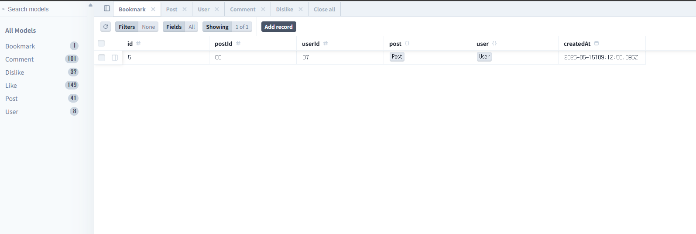 |
|:--:|
| **▲ Prisma Studio 모델 확인** |

### 검증 내용

- `npx prisma validate`로 schema 유효성을 확인함.
- `npx prisma migrate dev`로 개발 DB migration 적용 여부 확인.
- 게시글 삭제 시 연결된 댓글, 좋아요, 싫어요, 북마크가 남지 않는지 확인함.

---

## 4. 회원가입 / 로그인 / 로그아웃

### 기능 설명

사용자는 아이디, 닉네임, 비밀번호로 회원가입할 수 있고, 로그인 후 JWT httpOnly cookie로 인증 상태가 유지됨.

### 동작 방식

- 회원가입 시 아이디와 닉네임 중복을 검사함.
- 아이디는 4~30자의 영문, 숫자, `_`, `-`, `.`, `@` 조합을 허용하며 `@`는 필수가 아님.
- 비밀번호는 bcrypt로 hash 처리하여 저장함.
- 로그인 성공 시 JWT를 httpOnly cookie에 저장함.
- 로그아웃 시 인증 cookie를 제거함.
- `/api/auth/me`로 현재 로그인 상태를 확인함.

### 관련 API 또는 DB

| Method | Endpoint | 설명 |
|---|---|---|
| POST | `/api/auth/register` | 회원가입 |
| POST | `/api/auth/login` | 로그인 |
| POST | `/api/auth/logout` | 로그아웃 |
| GET | `/api/auth/me` | 현재 사용자 조회 |

| DB 모델 | 관련 필드 |
|---|---|
| User | `loginId`, `nickname`, `passwordHash`, `createdAt` |

### 관련 코드

관련 파일: `server/controllers/auth.controller.js`

```js
const passwordHash = await bcrypt.hash(password, SALT_ROUNDS);
const user = await prisma.user.create({
  data: {
    loginId,
    nickname,
    passwordHash,
  },
});

const token = signAuthToken(user);
setAuthCookie(res, token);
```

관련 파일: `server/controllers/auth.controller.js`

```js
const isPasswordValid = await bcrypt.compare(password, user.passwordHash);

if (!isPasswordValid) {
  return res.status(401).json({ message: "아이디 또는 비밀번호가 올바르지 않습니다." });
}

const token = signAuthToken(user);
setAuthCookie(res, token);
```

관련 파일: `server/utils/authCookie.js`

```js
function setAuthCookie(res, token) {
  res.cookie(COOKIE_NAME, token, getCookieOptions());
}

function clearAuthCookie(res) {
  const { maxAge, ...options } = getCookieOptions();
  res.clearCookie(COOKIE_NAME, options);
}
```

### 관련 화면

- `public/register.html`
- `public/login.html`
- `public/index.html` 상단 사용자 영역

| 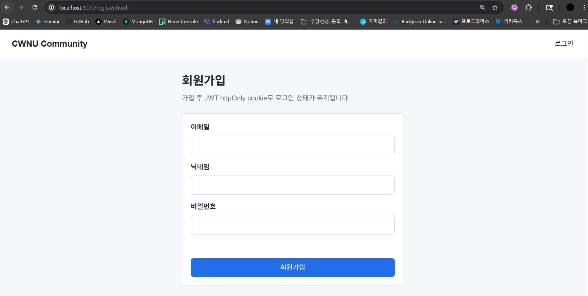 | 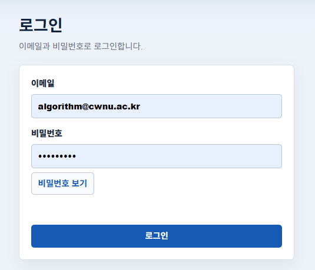 |
|:--:|:--:|
| **▲ 회원가입 화면** | **▲ 로그인 화면** |

| 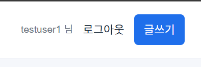 |
|:--:|
| **▲ 로그인 후 헤더** |

### 검증 내용

- 새 계정으로 회원가입이 되는지 확인함.
- 같은 아이디 또는 같은 닉네임으로 중복 가입 거부 여부 확인.
- 로그인 후 헤더에 사용자 닉네임 표시 여부 확인.
- 로그아웃 후 `/api/auth/me`가 비로그인 상태를 반환하는지 확인함.

---

## 5. 비밀번호 보기 / 닉네임 변경 / 비밀번호 변경 / 회원 탈퇴

### 기능 설명

회원가입/로그인 화면에서는 비밀번호 보기/숨기기를 지원함. 로그인 사용자는 마이페이지에서 닉네임과 비밀번호를 변경하거나 계정을 탈퇴할 수 있음.

### 동작 방식

- 비밀번호 보기 버튼은 input type을 `password`와 `text`로 전환함.
- 닉네임 변경은 로그인 사용자 본인의 `User.nickname`만 수정함.
- 닉네임은 trim 처리 후 2자 이상 20자 이하로 검증함.
- 비밀번호 변경은 현재 비밀번호 확인 후 새 비밀번호 hash를 저장함.
- 회원 탈퇴 시 현재 로그인 사용자 기준으로 계정과 관련 데이터를 삭제하고 인증 cookie를 제거함.

### 관련 API 또는 DB

| Method | Endpoint | 설명 |
|---|---|---|
| PATCH | `/api/auth/me` | 닉네임 변경 |
| PATCH | `/api/auth/password` | 비밀번호 변경 |
| DELETE | `/api/auth/me` | 회원 탈퇴 |
| GET | `/api/auth/me/activity` | 마이페이지 활동 조회 |

| DB 모델 | 관련 필드 |
|---|---|
| User | `nickname`, `loginId`, `passwordHash`, `createdAt` |
| Post/Comment/Like/Dislike/Bookmark | 회원 탈퇴 시 정리 대상 |

### 관련 코드

관련 파일: `public/js/auth.js`

```js
function bindPasswordToggles() {
  document.querySelectorAll("[data-password-toggle]").forEach((button) => {
    const label = button.closest("label");
    const passwordInput = label?.querySelector('input[type="password"], input[type="text"][name="password"]');

    button.addEventListener("click", () => {
      const isHidden = passwordInput.type === "password";
      passwordInput.type = isHidden ? "text" : "password";
      button.textContent = isHidden ? "비밀번호 숨기기" : "비밀번호 보기";
    });
  });
}
```

관련 파일: `server/controllers/auth.controller.js`

```js
const user = await prisma.user.update({
  where: { id: req.user.id },
  data: { nickname },
  select: {
    id: true,
    loginId: true,
    nickname: true,
    createdAt: true,
  },
});
```

관련 파일: `server/controllers/auth.controller.js`

```js
const isPasswordValid = await bcrypt.compare(currentPassword, user.passwordHash);

if (!isPasswordValid) {
  return res.status(400).json({ message: "현재 비밀번호가 올바르지 않습니다." });
}

const passwordHash = await bcrypt.hash(newPassword, SALT_ROUNDS);

await prisma.user.update({
  where: { id: req.user.id },
  data: { passwordHash },
});
```

관련 파일: `server/controllers/auth.controller.js`

```js
await prisma.$transaction(async (tx) => {
  await tx.post.deleteMany({ where: { userId } });
  await tx.comment.deleteMany({ where: { userId } });
  await tx.like.deleteMany({ where: { userId } });
  await tx.dislike.deleteMany({ where: { userId } });
  await tx.bookmark.deleteMany({ where: { userId } });
  await tx.user.delete({ where: { id: userId } });
});
```

### 관련 화면

- `public/register.html`
- `public/login.html`
- `public/mypage.html`

| 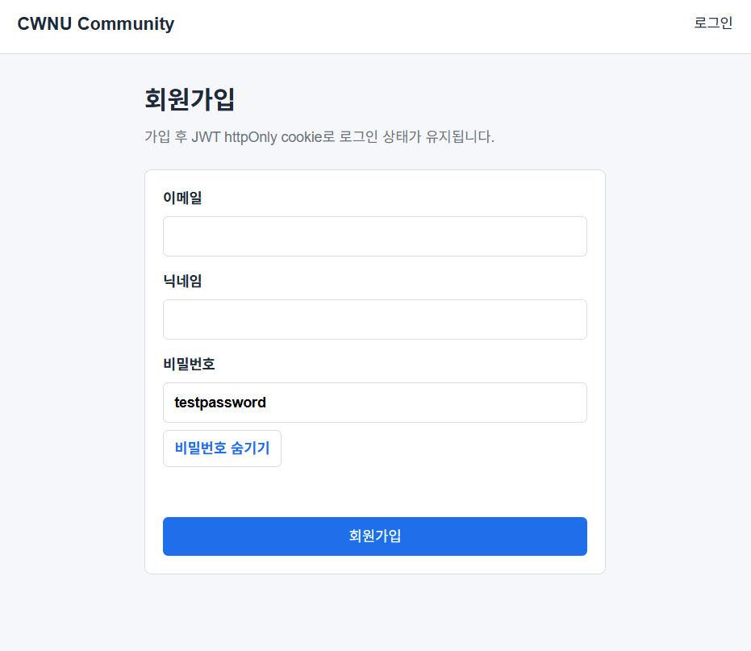 | 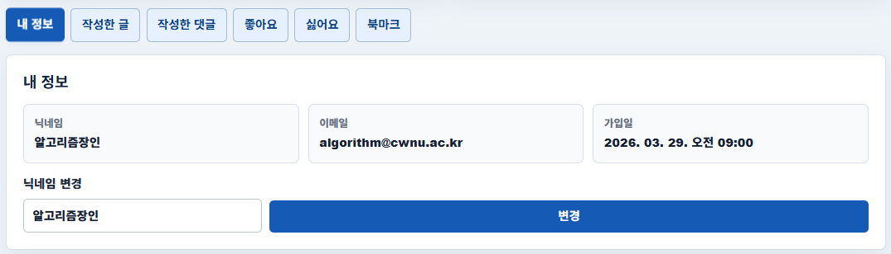 |
|:--:|:--:|
| **▲ 비밀번호 보기 숨기기** | **▲ 닉네임 변경** |

| 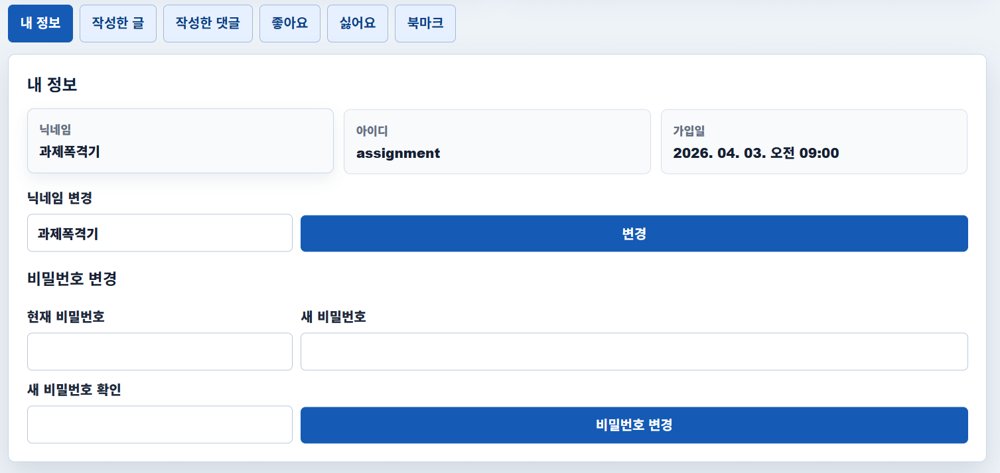 | 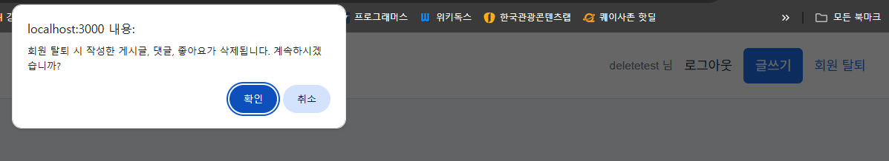 |
|:--:|:--:|
| **▲ 현재 비밀번호 확인 후 새 비밀번호 변경** | **▲ 회원 탈퇴 확인** |

### 검증 내용

- 비밀번호 보기/숨기기 버튼이 정상 전환되는지 확인함.
- 닉네임 변경 후 헤더와 마이페이지에 변경된 닉네임 표시 여부 확인.
- 비밀번호 변경 시 현재 비밀번호 오류, 새 비밀번호 확인 불일치, 성공 케이스를 확인함.
- 비로그인 상태에서 닉네임 변경 API 요청 시 401 반환 여부 확인.
- 회원 탈퇴 후 로그인 상태가 해제되고 사용자 데이터 삭제 여부 확인.

---

## 6. 게시글 목록 / 게시판 / 공지사항 / 인기글

### 기능 설명

메인 페이지에서는 전체글, 인기글, 공지사항, 카테고리 게시판을 볼 수 있음. v1.2.0 기준으로 메인 상단은 커뮤니티 대시보드형 화면으로 구성되어 전체 게시글 수, 인기글 산정 글, 공지사항 수, 댓글/답글 수를 요약 카드로 표시함. Smart Portal 연계 시 특정 게시판 URL로 직접 이동할 수 있도록 query parameter 기반 진입을 지원함.

### 동작 방식

- 전체글, 인기글, 공지사항, 자유게시판, 공부이야기, 질문게시판, 정보공유, 중고장터, 분실물은 게시판 바로가기 영역에서 이동 가능함.
- `board` query와 `category` query를 통해 게시판별 목록을 조회함.
- `/?board=hot`은 hotScore 기준 인기글을 표시함.
- `/?board=notice`는 공지사항 게시판을 표시함.
- Smart Portal 연계 시 중고장터와 분실물은 각각 `/?category=market`, `/?category=lost`로 연결 가능함.
- 게시글 목록에는 제목, 카테고리, 작성자, 등록일, 수정일, 조회수, 댓글 수, 좋아요 수, 싫어요 수가 표시됨.
- 메인 대시보드에는 인기글 TOP 3, 공지사항, 최근글 프리뷰 패널을 표시함.
- 프리뷰 패널은 Hot, Notice, Latest 성격에 맞게 색상 포인트, 순위 배지, hover/focus 스타일을 구분함.
- 카테고리별 바로가기 카드는 자유게시판, 공부이야기, 질문게시판, 정보공유, 중고장터, 분실물의 색상 체계를 반영함.
- 최근 본 게시글은 localStorage 기반으로 최대 5개까지 저장하여 메인과 상세 화면에서 다시 접근할 수 있도록 구성함.

### 관련 API 또는 DB

| Method | Endpoint | 설명 |
|---|---|---|
| GET | `/api/posts` | 게시글 목록 조회 |

| Query | 설명 |
|---|---|
| `board=hot` | 인기글 |
| `board=notice` | 공지사항 |
| `category=free/study/question/info/market/lost` | 카테고리 게시판 |

| DB 모델 | 관련 필드 |
|---|---|
| Post | `category`, `viewCount`, `createdAt`, `updatedAt` |
| Comment/Like/Dislike | 목록 count 표시 |
| localStorage | 최근 본 게시글, 보기 모드 상태 |

### 관련 코드

관련 파일: `server/controllers/post.controller.js`

```js
const ALLOWED_BOARDS = ["all", "hot", "notice"];
const ALLOWED_CATEGORIES = ["notice", "free", "study", "question", "info", "market", "lost"];

const effectiveCategory = board === "notice" ? "notice" : category;
const where = getPostSearchWhere(q, effectiveCategory);

if (board === "hot") {
  const sortedPosts = posts
    .map((post) => ({
      ...post,
      hotScore: post.viewCount + post._count.likes * 10 + post._count.comments * 5 - post._count.dislikes * 3,
    }))
    .sort((a, b) => b.hotScore - a.hotScore || b.createdAt.getTime() - a.createdAt.getTime());
}
```

관련 파일: `public/js/posts.js`

```js
const previewQueries = {
  hot: new URLSearchParams({ board: "hot", pageSize: "10" }),
  notice: new URLSearchParams({ board: "notice", pageSize: "10" }),
  latest: new URLSearchParams({ sort: "latest", pageSize: "10" }),
};

const [hotResult, noticeResult, latestResult] = await Promise.allSettled([
  fetchPreviewPosts(previewQueries.hot),
  fetchPreviewPosts(previewQueries.notice),
  fetchPreviewPosts(previewQueries.latest),
]);
```

관련 파일: `public/js/posts.js`

```js
function saveRecentPost(post) {
  const recentPost = {
    id: post.id,
    title: post.title,
    category: post.category,
    viewedAt: new Date().toISOString(),
  };
  const nextPosts = [
    recentPost,
    ...readRecentPosts().filter((item) => item.id !== post.id),
  ].slice(0, RECENT_POST_LIMIT);

  writeRecentPosts(nextPosts);
}
```

### 관련 화면

- `public/index.html`

|  | 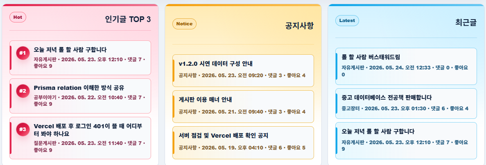 |
|:--:|:--:|
| **▲ 메인 대시보드** | **▲ Hot / Notice / Latest 프리뷰** |

| 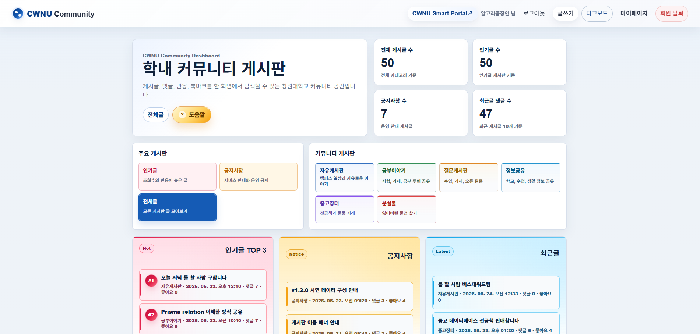 | 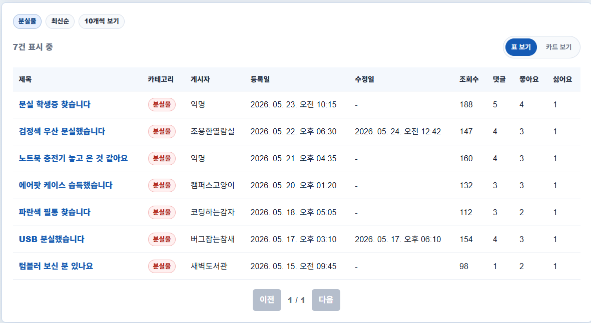 |
|:--:|:--:|
| **▲ 주요 게시판 카드** | **▲ 카테고리 게시판 목록** |

### 검증 내용

- `/`에서 전체글 표시 여부 확인.
- `/?board=hot`에서 인기글이 hotScore 기준으로 표시 여부 확인.
- `/?board=notice`에서 공지사항 글만 표시 여부 확인.
- `/?category=market`, `/?category=lost`가 Smart Portal 연계 URL로 사용 가능 여부 확인.
- 메인 대시보드 요약 카드와 인기글/공지사항/최근글 프리뷰가 정상 표시되는지 확인.
- 프리뷰 패널 클릭 시 게시글 상세로 이동하는지 확인.
- 최근 본 게시글이 localStorage에 저장되고 중복 없이 최신순으로 유지되는지 확인.

---

## 7. 검색 / 정렬 / 페이징

### 기능 설명

게시글 목록에서는 검색어, 정렬, 표시 개수, 페이지 이동을 지원함. v1.2.0 기준으로 검색어 지우기 버튼, 최근 검색어, 검색어 하이라이트, filter summary, result summary, 표 보기/카드 보기 전환을 함께 제공함.

### 동작 방식

- 검색 대상은 게시글 제목, 내용, 작성자 닉네임임.
- 정렬은 최신순, 좋아요순, 조회수순, 댓글순을 지원함.
- 페이지 크기는 10/20/30/40/50개만 허용함.
- 검색, 정렬, 카테고리, 공지사항, 인기글 조건은 함께 동작함.
- 검색창의 X 버튼은 현재 검색어를 제거하고 `q` query를 초기화함.
- 검색 실행 시 최근 검색어를 localStorage에 최대 5개까지 저장하고, chip 클릭으로 재검색할 수 있음.
- 검색어가 제목에 포함되면 목록 table과 card 제목에서 하이라이트 처리함.
- filter summary는 현재 게시판, 검색어, 정렬, 표시 개수를 chip으로 표시함.
- result summary는 검색 결과 수와 현재 표시 맥락을 문장으로 표시함.
- 보기 모드는 `table`과 `card`를 지원하고 localStorage에 저장함.

### 관련 API 또는 DB

| Method | Endpoint | 설명 |
|---|---|---|
| GET | `/api/posts?page=1&pageSize=10&sort=latest&q=검색어` | 게시글 검색/정렬/페이징 |

| Query | 설명 |
|---|---|
| `q` | 제목/내용/작성자 닉네임 검색 |
| `sort=latest` | 최신순 |
| `sort=likes` | 좋아요순 |
| `sort=views` | 조회수순 |
| `sort=comments` | 댓글순 |
| `pageSize=10/20/30/40/50` | 페이지 크기 |

| 클라이언트 저장소 | 설명 |
|---|---|
| `cwnu.community.recentSearches` | 최근 검색어 |
| `cwnu.community.viewMode` | 표 보기/카드 보기 모드 |

### 관련 코드

관련 파일: `server/controllers/post.controller.js`

```js
const ALLOWED_PAGE_SIZES = [10, 20, 30, 40, 50];
const ALLOWED_SORTS = ["latest", "likes", "views", "comments"];

function getPostOrderBy(sort) {
  if (sort === "likes") {
    return [{ likes: { _count: "desc" } }, { createdAt: "desc" }];
  }
  if (sort === "views") {
    return [{ viewCount: "desc" }, { createdAt: "desc" }];
  }
  if (sort === "comments") {
    return [{ comments: { _count: "desc" } }, { createdAt: "desc" }];
  }
  return [{ createdAt: "desc" }];
}
```

관련 파일: `server/controllers/post.controller.js`

```js
if (keyword) {
  where.OR = [
    { title: { contains: keyword, mode: "insensitive" } },
    { content: { contains: keyword, mode: "insensitive" } },
    { author: { is: { nickname: { contains: keyword, mode: "insensitive" } } } },
  ];
}
```

관련 파일: `public/js/posts.js`

```js
function appendHighlightedText(target, text, keyword) {
  const value = String(text || "");
  const searchTerm = normalizeSearchTerm(keyword);

  if (!searchTerm) {
    target.textContent = value;
    return;
  }

  const matchIndex = value.toLocaleLowerCase().indexOf(searchTerm.toLocaleLowerCase());
  if (matchIndex === -1) {
    target.textContent = value;
    return;
  }

  const endIndex = matchIndex + searchTerm.length;
  const highlight = document.createElement("mark");
  highlight.className = "search-highlight";
  highlight.textContent = value.slice(matchIndex, endIndex);
  target.appendChild(highlight);
}
```

관련 파일: `public/js/posts.js`

```js
function setViewMode(mode) {
  if (!VIEW_MODES.includes(mode)) {
    return;
  }

  postState.viewMode = mode;
  storeViewMode(mode);
  applyViewMode();
}
```

### 관련 화면

- `public/index.html`

| 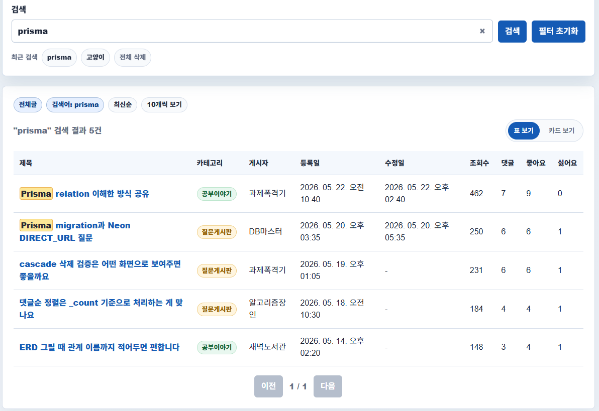 | 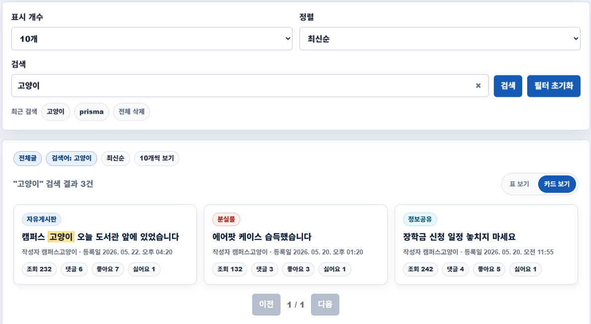 |
|:--:|:--:|
| **▲ 검색어 하이라이트** | **▲ filter summary / result summary** |

| 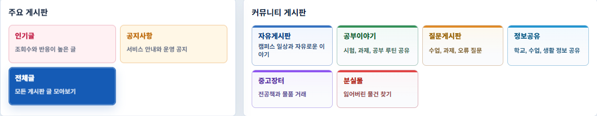 | 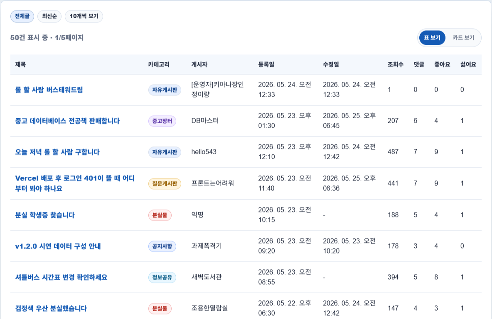 |
|:--:|:--:|
| **▲ 검색/정렬/표시 개수 컨트롤** | **▲ 표 보기 목록** |

| 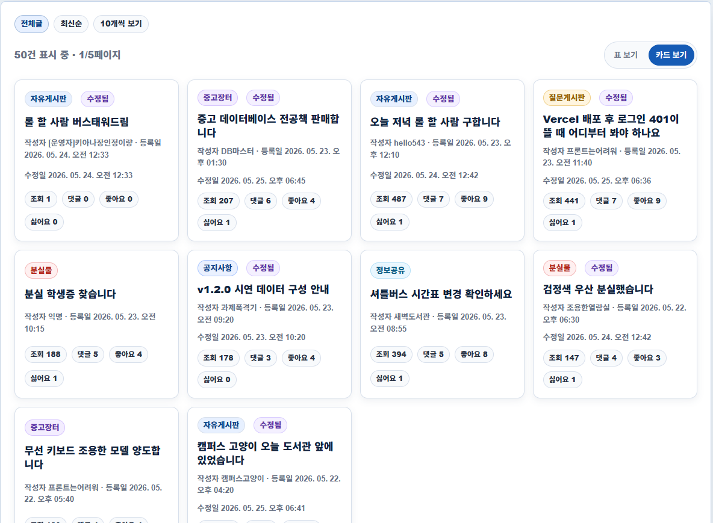 |  |
|:--:|:--:|
| **▲ 카드 보기 목록** | **▲ 카테고리/게시판 필터 결과** |

### 검증 내용

- 제목, 내용, 작성자 닉네임 검색이 되는지 확인함.
- 검색 결과가 없을 때 안내 문구 표시 여부 확인.
- 좋아요순, 조회수순, 댓글순 정렬이 실제 count 기준으로 동작 여부 확인.
- pageSize가 10/20/30/40/50 단위로 변경되는지 확인함.
- 검색어 지우기 버튼으로 `q` query가 제거되는지 확인함.
- 최근 검색어 저장, 중복 제거, 최대 5개 유지 여부 확인.
- table/card 보기 모두에서 검색어 하이라이트가 XSS 위험 없이 표시되는지 확인.
- 보기 모드가 새로고침 후에도 유지되는지 확인.

---

## 8. 게시글 작성 / 상세 / 수정 / 삭제

### 기능 설명

로그인 사용자는 게시글을 작성할 수 있으며, 작성자 본인만 수정과 삭제를 할 수 있음. v1.2.0 기준으로 글쓰기 화면은 카테고리별 작성 가이드, 글자 수 카운터, 작성/미리보기 탭, localStorage 임시저장, 작성 중 나가기 경고를 제공함. 게시글 상세 화면은 상세 헤더 2줄 메타 구조, 댓글 이동 버튼, 맨 위로 이동 버튼, 읽기 진행 보조 UI, 관련 게시글 추천 영역을 제공함.

### 동작 방식

- 글 작성 시 제목, 내용, 카테고리를 입력함.
- 익명 작성 체크 시 목록과 상세 화면의 작성자는 “익명”으로 표시됨.
- 상세 조회 시 조회수가 증가함.
- 작성자 본인에게만 수정/삭제 버튼이 표시됨.
- 서버에서도 현재 로그인 사용자와 게시글 작성자 userId를 비교하여 권한을 검증함.
- 게시글 삭제 시 댓글, 답글, 좋아요, 싫어요, 북마크도 함께 삭제됨.
- 글쓰기 화면에서 카테고리 선택에 따라 작성 가이드와 제목/내용 placeholder를 갱신함.
- 제목과 내용은 권장 글자 수 카운터를 표시함.
- 작성/미리보기 탭을 통해 HTML 렌더링 없이 일반 텍스트 미리보기를 제공함.
- 새 글 작성 중인 draft는 `cwnu.community.postDraft`에 저장하고, 작성 성공 시 삭제함.
- 변경사항이 있는 상태에서 이탈하면 `beforeunload` 경고를 표시함.
- 상세 화면 하단에는 같은 카테고리 글, 다른 인기글, 최근 본 글을 추천 영역으로 표시함.
- 댓글 보기 버튼은 댓글 영역으로 이동하고, 맨 위 버튼은 상세 상단으로 이동함.

### 관련 API 또는 DB

| Method | Endpoint | 설명 |
|---|---|---|
| GET | `/api/posts/:id` | 게시글 상세 |
| POST | `/api/posts` | 게시글 작성 |
| PUT | `/api/posts/:id` | 게시글 수정 |
| DELETE | `/api/posts/:id` | 게시글 삭제 |

| DB 모델 | 관련 필드 |
|---|---|
| Post | `title`, `content`, `category`, `isAnonymous`, `viewCount`, `userId`, `createdAt`, `updatedAt` |
| localStorage | 글쓰기 draft, 최근 본 게시글 |

### 관련 코드

관련 파일: `server/controllers/post.controller.js`

```js
const post = await prisma.post.create({
  data: {
    title,
    content,
    category,
    isAnonymous,
    userId: req.user.id,
  },
  include: {
    author: { select: { id: true, nickname: true } },
    _count: { select: { comments: true, likes: true, dislikes: true, bookmarks: true } },
  },
});
```

관련 파일: `server/controllers/post.controller.js`

```js
if (existingPost.userId !== req.user.id) {
  return res.status(403).json({ message: "Only the author can update this post." });
}

const post = await prisma.post.update({
  where: { id: postId },
  data: {
    title,
    content,
    category,
    isAnonymous,
  },
});
```

관련 파일: `server/controllers/post.controller.js`

```js
if (post.userId !== req.user.id) {
  return res.status(403).json({ message: "Only the author can delete this post." });
}

await prisma.post.delete({
  where: { id: postId },
});
```

관련 파일: `public/js/posts.js`

```js
const POST_DRAFT_STORAGE_KEY = "cwnu.community.postDraft";

function updateWritePreview(form) {
  const snapshot = getPostWriteSnapshot(form);
  previewTitle.textContent = snapshot.title.trim() || "제목 미입력";
  previewBody.textContent = snapshot.content.trim() || "미리볼 내용이 없습니다.";
}
```

관련 파일: `public/js/posts.js`

```js
function updatePostMeta(post, commentCount = post.commentCount) {
  const profileItems = [
    { label: "작성자", value: getAuthorLabel(post) },
    { label: "등록일", value: formatDate(post.createdAt) },
  ];
  const statItems = [
    { label: "조회수", value: post.viewCount },
    { label: "댓글", value: commentCount },
    { label: "좋아요", value: post.likeCount },
    { label: "싫어요", value: post.dislikeCount || 0 },
  ];
}
```

### 관련 화면

- `public/post-write.html`
- `public/post-detail.html`
- `public/index.html`

| 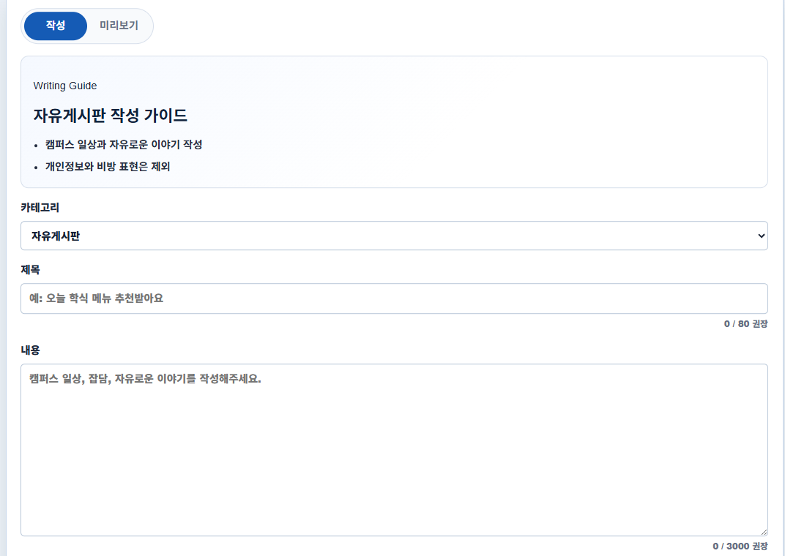 | 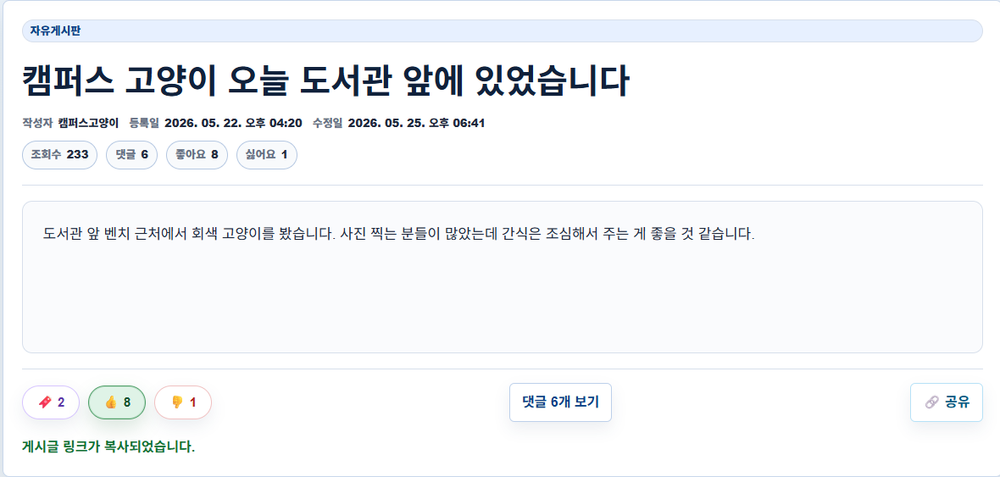 |
|:--:|:--:|
| **▲ 카테고리별 작성 가이드** | **▲ 게시글 상세 헤더** |

| 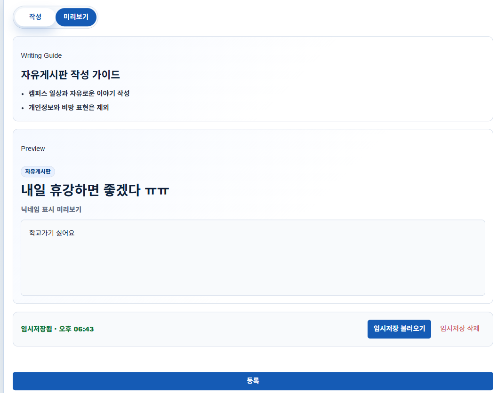 | 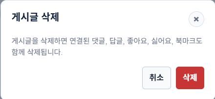 |
|:--:|:--:|
| **▲ 작성/미리보기 탭** | **▲ 게시글 삭제 Confirm Modal** |

| 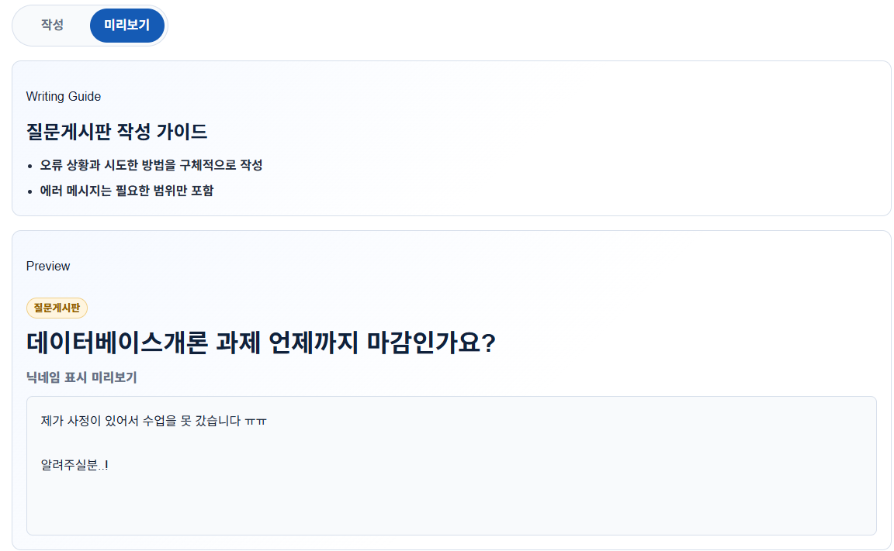 |
|:--:|
| **▲ 익명/카테고리 글쓰기 미리보기** |

### 검증 내용

- 비로그인 사용자는 글 작성 화면 접근 제한 여부 확인.
- 제목/내용 공백 입력 거부 여부 확인.
- 작성자 본인만 수정/삭제 버튼을 볼 수 있는지 확인함.
- 다른 사용자의 게시글 수정/삭제 요청이 403으로 거부 여부 확인.
- 삭제 후 관련 댓글/답글/반응/북마크가 남지 않는지 확인함.
- 카테고리 변경 시 작성 가이드와 placeholder가 바뀌는지 확인함.
- 작성/미리보기 탭 전환과 텍스트 미리보기 표시 여부 확인.
- 임시저장 생성, 불러오기, 삭제, 작성 성공 후 삭제 여부 확인.
- 댓글 이동 버튼, 맨 위 이동 버튼, 관련 게시글 추천 영역 동작 여부 확인.

---

## 9. 댓글 / 답글 / 댓글 수정 / 익명 댓글

### 기능 설명

게시글 상세 화면에서 댓글과 1단계 답글을 작성, 조회, 수정, 삭제할 수 있음. 댓글과 답글 모두 익명 작성이 가능함.

### 동작 방식

- 댓글은 `parentId=null`로 저장됨.
- 답글은 부모 댓글의 id를 `parentId`로 저장함.
- 답글의 답글은 서버에서 400으로 거부함.
- 본인이 작성한 댓글/답글에만 수정/삭제 버튼이 표시됨.
- 익명 댓글/답글은 화면에서 작성자를 “익명”으로 표시함.
- 내부적으로는 `userId`를 유지하여 수정/삭제 권한을 검증함.

### 관련 API 또는 DB

| Method | Endpoint | 설명 |
|---|---|---|
| GET | `/api/posts/:postId/comments` | 댓글/답글 조회 |
| POST | `/api/posts/:postId/comments` | 댓글/답글 작성 |
| PUT | `/api/comments/:id` | 댓글/답글 수정 |
| DELETE | `/api/comments/:id` | 댓글/답글 삭제 |

| DB 모델 | 관련 필드 |
|---|---|
| Comment | `content`, `postId`, `userId`, `parentId`, `isAnonymous`, `createdAt`, `updatedAt` |

### 관련 코드

관련 파일: `server/controllers/comment.controller.js`

```js
if (parentId) {
  const parentComment = await prisma.comment.findUnique({
    where: { id: parentId },
    select: {
      id: true,
      postId: true,
      parentId: true,
    },
  });

  if (parentComment.parentId) {
    return res.status(400).json({ message: "Replies can only be added to top-level comments." });
  }
}
```

관련 파일: `server/controllers/comment.controller.js`

```js
const comment = await prisma.comment.create({
  data: {
    postId,
    userId: req.user.id,
    parentId,
    content,
    isAnonymous,
  },
  include: {
    author: { select: { id: true, nickname: true } },
  },
});
```

관련 파일: `server/controllers/comment.controller.js`

```js
if (existingComment.userId !== req.user.id) {
  return res.status(403).json({ message: "Only the comment author can update this comment." });
}

const comment = await prisma.comment.update({
  where: { id: commentId },
  data: { content },
});
```

### 관련 화면

- `public/post-detail.html`

| 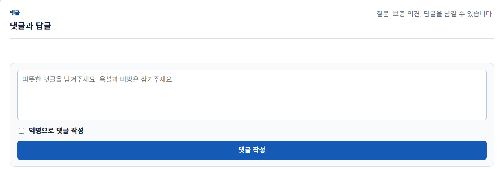 | 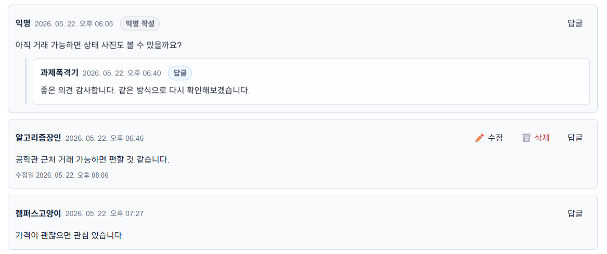 |
|:--:|:--:|
| **▲ 댓글 작성 영역** | **▲ 댓글/답글 목록** |

| 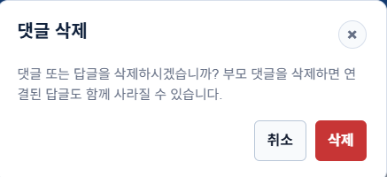 | 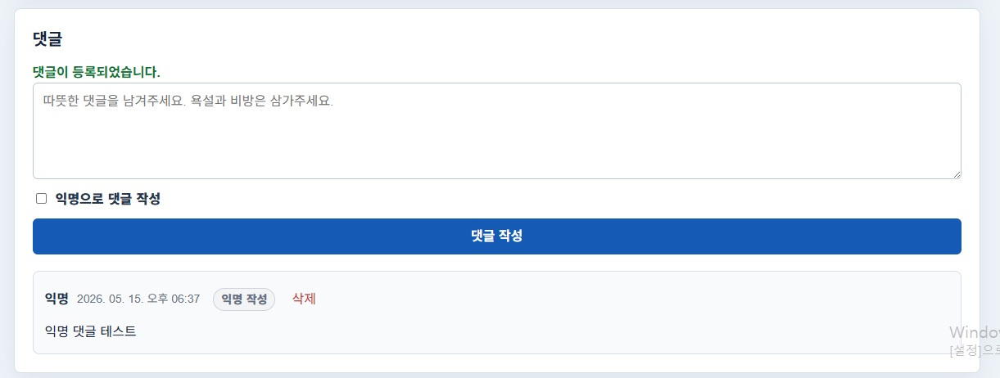 |
|:--:|:--:|
| **▲ 댓글 삭제 Confirm Modal** | **▲ 익명 댓글** |

| 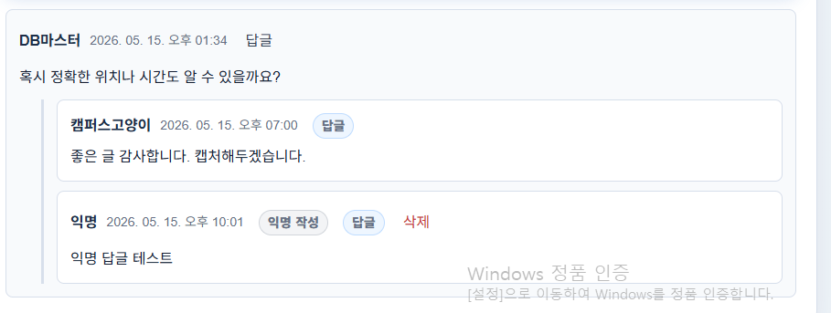 |
|:--:|
| **▲ 답글의 답글 제한** |

### 검증 내용

- 댓글 작성 후 목록에 즉시 반영되는지 확인함.
- 답글이 일반 댓글 아래에 들여쓰기 형태로 표시 여부 확인.
- 답글의 답글 작성 시도 거부 여부 확인.
- 본인 댓글/답글만 수정/삭제 가능 여부 확인.
- 익명 댓글/답글 수정 후에도 작성자가 “익명”으로 유지 여부 확인.

---

## 10. 좋아요 / 싫어요 / 북마크

### 기능 설명

로그인 사용자는 게시글에 좋아요, 싫어요, 북마크를 할 수 있음. 좋아요와 싫어요는 동시에 적용되지 않도록 처리함.

### 동작 방식

- 한 사용자는 한 게시글에 좋아요를 한 번만 누를 수 있음.
- 한 사용자는 한 게시글에 싫어요를 한 번만 누를 수 있음.
- 좋아요 상태에서 싫어요를 누르면 좋아요가 삭제되고 싫어요가 생성됨.
- 싫어요 상태에서 좋아요를 누르면 싫어요가 삭제되고 좋아요가 생성됨.
- 북마크는 중복 저장되지 않음.
- 상세 응답에는 현재 사용자의 liked, disliked, bookmarked 상태와 count가 포함됨.

### 관련 API 또는 DB

| Method | Endpoint | 설명 |
|---|---|---|
| POST | `/api/posts/:postId/like` | 좋아요 |
| DELETE | `/api/posts/:postId/like` | 좋아요 취소 |
| POST | `/api/posts/:postId/dislike` | 싫어요 |
| DELETE | `/api/posts/:postId/dislike` | 싫어요 취소 |
| POST | `/api/posts/:postId/bookmark` | 북마크 |
| DELETE | `/api/posts/:postId/bookmark` | 북마크 취소 |

| DB 모델 | 제약 |
|---|---|
| Like | `@@unique([postId, userId])` |
| Dislike | `@@unique([postId, userId])` |
| Bookmark | `@@unique([postId, userId])` |

### 관련 코드

관련 파일: `server/controllers/like.controller.js`

```js
await prisma.$transaction(async (tx) => {
  await tx.dislike.deleteMany({
    where: {
      postId,
      userId: req.user.id,
    },
  });

  await tx.like.upsert({
    where: { postId_userId: { postId, userId: req.user.id } },
    update: {},
    create: { postId, userId: req.user.id },
  });
});
```

관련 파일: `server/controllers/dislike.controller.js`

```js
await prisma.$transaction(async (tx) => {
  await tx.like.deleteMany({
    where: {
      postId,
      userId: req.user.id,
    },
  });

  await tx.dislike.upsert({
    where: { postId_userId: { postId, userId: req.user.id } },
    update: {},
    create: { postId, userId: req.user.id },
  });
});
```

관련 파일: `server/controllers/bookmark.controller.js`

```js
await prisma.bookmark.upsert({
  where: {
    postId_userId: {
      postId,
      userId: req.user.id,
    },
  },
  update: {},
  create: {
    postId,
    userId: req.user.id,
  },
});
```

### 관련 화면

- `public/post-detail.html`
- `public/index.html`
- `public/mypage.html`

| 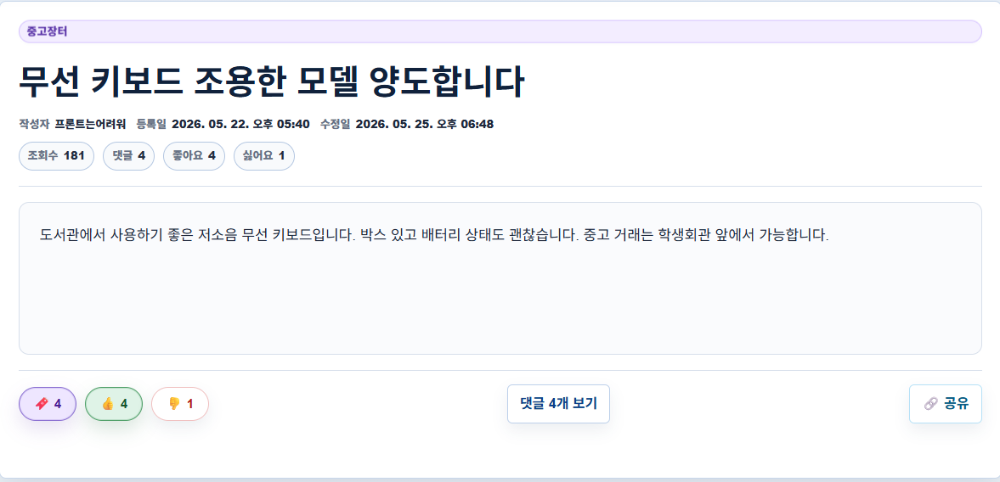 | 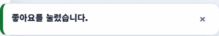 |
|:--:|:--:|
| **▲ 반응/북마크 버튼** | **▲ 반응 Toast 피드백** |

| 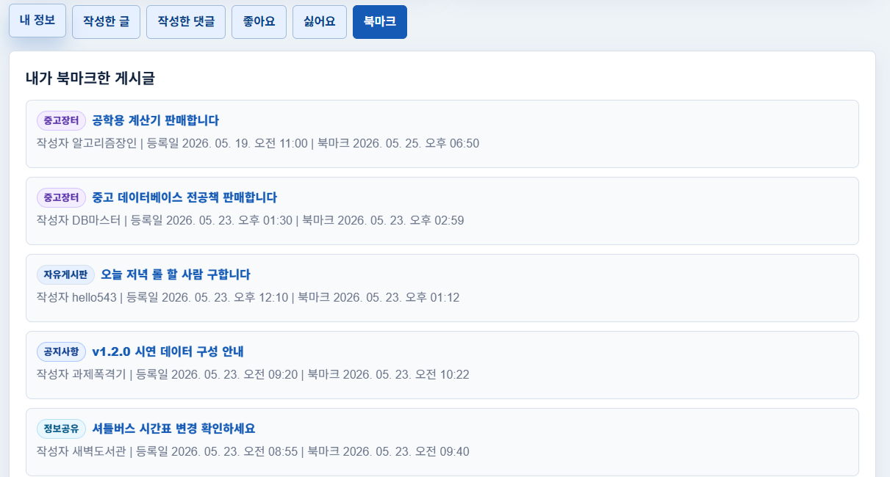 |
|:--:|
| **▲ 북마크 목록** |

### 검증 내용

- 좋아요/싫어요/북마크 버튼 클릭 시 count와 상태가 갱신되는지 확인함.
- 좋아요와 싫어요가 동시에 적용되지 않는지 확인함.
- 같은 게시글에 중복 좋아요/북마크가 생성되지 않는지 확인함.
- 비로그인 사용자는 반응 기능 사용 제한 여부 확인.

---

## 11. 마이페이지

### 기능 설명

마이페이지에서는 로그인 사용자의 계정 정보와 활동 내역을 확인할 수 있음. v1.2.0 기준으로 단순 목록형 화면에서 프로필 요약, 활동 통계 카드, 최근 활동 타임라인, 활동 유형 배지, 많이 활동한 게시판 Top 3를 포함한 대시보드형 화면으로 확장함.

### 동작 방식

- 비로그인 사용자가 접근하면 로그인 안내 또는 로그인 페이지 이동 처리를 함.
- 로그인 사용자는 내 정보, 작성한 글, 작성한 댓글/답글, 좋아요, 싫어요, 북마크 목록을 확인함.
- 작성한 글 목록은 카테고리 필터를 지원함.
- 닉네임 변경, 비밀번호 변경, 회원 탈퇴도 마이페이지에서 수행함.
- 상단 프로필 요약 카드에는 닉네임, 아이디, 가입일, 계정 상태를 표시함.
- 활동 통계 카드는 작성 글, 댓글/답글, 좋아요, 싫어요, 북마크 수를 표시함.
- 최근 활동 타임라인은 작성 글, 댓글/답글, 좋아요, 싫어요, 북마크 활동을 최신순으로 통합 표시함.
- 많이 활동한 게시판은 작성 글과 반응 데이터의 category를 기반으로 상위 3개를 계산함.
- 활동 유형 배지는 글, 댓글, 답글, 좋아요, 싫어요, 북마크를 구분함.

### 관련 API 또는 DB

| Method | Endpoint | 설명 |
|---|---|---|
| GET | `/api/auth/me/activity` | 현재 사용자 활동 조회 |
| PATCH | `/api/auth/me` | 닉네임 변경 |
| PATCH | `/api/auth/password` | 비밀번호 변경 |
| DELETE | `/api/auth/me` | 회원 탈퇴 |

| DB 모델 | 표시 데이터 |
|---|---|
| User | 닉네임, 아이디, 가입일 |
| Post | 내가 작성한 게시글 |
| Comment | 내가 작성한 댓글/답글 |
| Like/Dislike/Bookmark | 내가 반응한 게시글 |

### 관련 코드

관련 파일: `server/controllers/auth.controller.js`

```js
const [user, posts, comments, likes, dislikes, bookmarks] = await Promise.all([
  prisma.user.findUnique({
    where: { id: userId },
    select: {
      id: true,
      loginId: true,
      nickname: true,
      createdAt: true,
    },
  }),
  prisma.post.findMany({
    where: { userId },
    orderBy: { createdAt: "desc" },
    select: {
      id: true,
      title: true,
      category: true,
      isAnonymous: true,
      createdAt: true,
      updatedAt: true,
      viewCount: true,
    },
  }),
]);
```

관련 파일: `public/js/mypage.js`

```js
async function loadMyPage() {
  try {
    const activity = await api.request("/api/auth/me/activity");

    renderProfile(activity.user);
    renderActivityStats(activity);
    renderRecentActivities(activity);
    renderActivityVisuals(activity);
    renderMyPosts(activity.posts);
    renderComments(activity.comments);
    renderBookmarks(activity.bookmarks || []);
  } catch (error) {
    setMyPageMessage("마이페이지를 보려면 로그인하세요.", "error");
  }
}
```

관련 파일: `public/js/mypage.js`

```js
function getRecentActivities(activity) {
  return [
    ...activity.posts.map((post) => ({
      type: "post",
      title: post.title,
      createdAt: post.createdAt,
    })),
    ...activity.comments.map((comment) => ({
      type: comment.parentId ? "reply" : "comment",
      title: comment.post?.title,
      createdAt: comment.createdAt,
    })),
    ...activity.likes.map((like) => ({
      type: "like",
      title: like.post?.title,
      createdAt: like.createdAt,
    })),
    ...activity.bookmarks.map((bookmark) => ({
      type: "bookmark",
      title: bookmark.post?.title,
      createdAt: bookmark.createdAt,
    })),
  ].sort((a, b) => new Date(b.createdAt).getTime() - new Date(a.createdAt).getTime());
}
```

### 관련 화면

- `public/mypage.html`

|  | 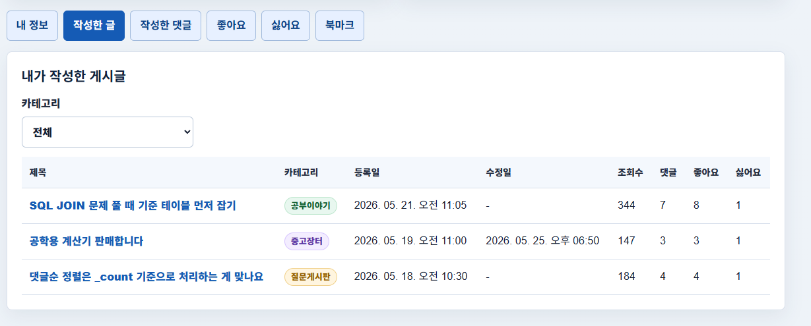 |
|:--:|:--:|
| **▲ 마이페이지 대시보드** | **▲ 마이페이지 작성 글** |

| 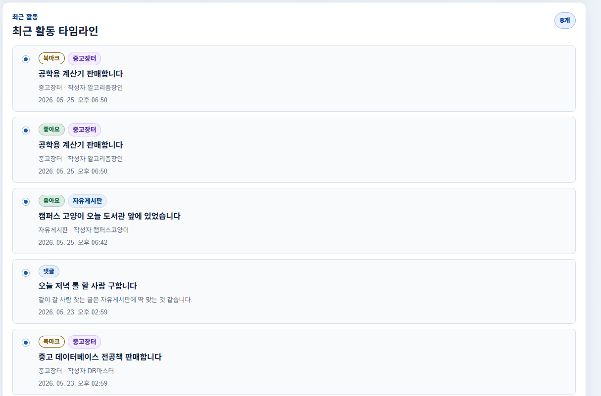 |  |
|:--:|:--:|
| **▲ 최근 활동 타임라인** | **▲ 마이페이지 북마크** |

|  |
|:--:|
| **▲ 마이페이지 비밀번호 변경 폼** |

### 검증 내용

- 로그인 후 마이페이지 접근 가능 여부 확인.
- 비로그인 상태에서 마이페이지 접근 제한 여부 확인.
- 작성한 글, 댓글, 좋아요, 싫어요, 북마크 목록 표시 여부 확인.
- 닉네임 변경 후 헤더와 마이페이지 정보가 갱신되는지 확인함.
- 비밀번호 변경 성공/실패 toast와 로그인 유지 여부를 확인함.
- 프로필 요약 카드와 활동 통계 카드가 `/api/auth/me/activity` 응답 기준으로 표시되는지 확인.
- 최근 활동 타임라인과 활동 유형 배지가 실제 활동과 맞는지 확인.
- 많이 활동한 게시판 Top 3가 사용 가능한 category 데이터 기준으로 표시되는지 확인.
- 빈 활동 데이터에서도 대시보드 레이아웃이 깨지지 않는지 확인.

---

## 12. 공유 링크

### 기능 설명

게시글 상세 화면에서 현재 게시글 URL을 클립보드에 복사할 수 있음.

### 동작 방식

- 공유 버튼을 클릭하면 현재 origin과 게시글 id를 조합함.
- 복사 형식은 `/post-detail.html?id=게시글ID`임.
- `navigator.clipboard`를 우선 사용하고 실패 시 fallback 처리를 함.
- 비로그인 사용자도 공유 기능을 사용할 수 있음.

### 관련 API 또는 DB

- 별도 DB 저장 없음
- 별도 API 호출 없음
- 클라이언트에서 현재 URL 기준으로 링크 생성

### 관련 코드

관련 파일: `public/js/posts.js`

```js
function bindShareButton(post) {
  const shareButton = document.querySelector("#share-post-button");

  if (!shareButton) {
    return;
  }

  shareButton.addEventListener("click", async () => {
    shareButton.disabled = true;

    try {
      const copied = await copyText(getShareUrl(post.id));
      setPostMessage(copied ? "게시글 링크가 복사되었습니다." : "링크 복사에 실패했습니다.", copied ? "success" : "error");
    } catch (error) {
      setPostMessage("링크 복사에 실패했습니다.", "error");
    } finally {
      shareButton.disabled = false;
    }
  });
}
```

### 관련 화면

- `public/post-detail.html`

| 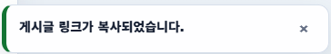 |
|:--:|
| **▲ 공유 링크 복사 Toast** |

### 검증 내용

- 공유 버튼 클릭 시 공유 성공 메시지 표시 여부 확인.
- 복사된 링크를 새 탭에 붙여넣으면 같은 게시글 상세 화면이 열리는지 확인함.
- 비로그인 상태에서도 공유 버튼 동작 여부 확인.

---

## 13. 도움말 투어

### 기능 설명

메인 게시판 페이지에는 주요 기능을 단계별로 설명하는 도움말 투어가 있음.

### 동작 방식

- 도움말 버튼 클릭 시 overlay와 안내 팝업이 표시됨.
- 게시판 바로가기, 표시 개수, 정렬, 검색, 게시글 목록, 글쓰기, 다크모드, 마이페이지 기능을 순서대로 안내함.
- 요소가 없으면 해당 단계를 건너뛰거나 로그인 후 사용 가능 문구로 처리함.
- ESC 키 또는 완료/건너뛰기 버튼으로 종료할 수 있음.

### 관련 API 또는 DB

- 별도 DB 저장 없음
- 별도 API 호출 없음
- `public/js/posts.js`와 CSS로 클라이언트 UI 처리

### 관련 코드

관련 파일: `public/js/posts.js`

```js
const GUIDE_STEP_DEFINITIONS = [
  {
    selector: ".board-shortcuts",
    title: "게시판 바로가기",
    description: "인기글, 공지사항, 전체글과 카테고리 게시판으로 바로 이동할 수 있습니다.",
  },
  {
    selector: "#page-size",
    title: "표시 개수",
    description: "한 페이지에 10, 20, 30, 40, 50개 단위로 게시글을 볼 수 있습니다.",
  },
  {
    selector: "#sort",
    title: "정렬",
    description: "최신순, 좋아요순, 조회수순, 댓글순으로 게시글 목록을 정렬할 수 있습니다.",
  },
];
```

관련 파일: `public/js/posts.js`

```js
guideState.keydownHandler = (event) => {
  if (event.key === "Escape") {
    endGuideTour();
  }
};

step.element.scrollIntoView({
  behavior: window.matchMedia("(prefers-reduced-motion: reduce)").matches ? "auto" : "smooth",
  block: "center",
  inline: "nearest",
});
```

### 관련 화면

- `public/index.html`

| 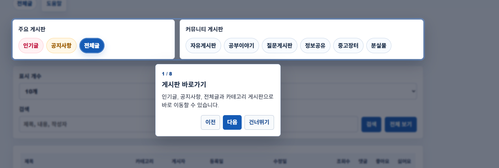 |
|:--:|
| **▲ 도움말 투어** |

### 검증 내용

- 도움말 버튼 클릭 시 투어가 시작되는지 확인함.
- 다음/이전/건너뛰기/완료 버튼 동작 여부 확인.
- ESC 키로 투어가 종료되는지 확인함.
- 다크모드에서도 overlay와 팝업 가독성 확인.

---

## 14. 다크모드 / UI 개선

### 기능 설명

전체 주요 페이지에서 라이트/다크모드 전환과 hover 인터랙션을 지원함. footer에는 과제 정보와 GitHub 링크, CWNU Smart Portal 링크를 제공함. v1.2.0 기준으로 Toast UI, 커스텀 Confirm Modal, Skeleton Loading, 로딩 spinner, 버튼 pending 상태, 모바일 Floating 글쓰기 버튼, 도움말 CTA, 프리뷰 패널 색상 체계까지 포함해 서비스형 UI/UX를 보강함.

### 동작 방식

- 테마는 `data-theme` 속성과 CSS 변수로 적용함.
- 사용자가 선택한 테마는 localStorage에 저장됨.
- 버튼, 카드, 게시판 바로가기, 링크에는 hover/active 효과가 적용됨.
- 주요 페이지 하단에는 과제 정보와 GitHub 링크가 표시됨.
- Toast 알림은 success/error/info/warning 상태를 구분하고 자동 닫힘과 닫기 버튼을 제공함.
- 삭제, 댓글 삭제, 회원 탈퇴 등 위험 동작은 브라우저 기본 confirm 대신 커스텀 Confirm Modal로 확인함.
- Skeleton Loading은 메인 대시보드, 게시글 목록, 게시글 상세, 마이페이지 대시보드 로딩 중 표시됨.
- 로딩 spinner와 버튼 pending 상태는 로그인, 회원가입, 글쓰기, 댓글 작성, 닉네임 변경 등 주요 비동기 동작에 적용됨.
- 모바일 Floating 글쓰기 버튼은 모바일 목록 탐색 중에도 글쓰기 화면으로 이동할 수 있게 함.
- 도움말 버튼은 메인 hero의 CTA 형태로 강조함.

### 관련 API 또는 DB

- 별도 DB 저장 없음
- localStorage key: `cwnu-community-theme`
- localStorage key: `cwnu.community.viewMode`, `cwnu.community.recentSearches`, `cwnu.community.recentPosts`, `cwnu.community.postDraft`

### 관련 코드

관련 파일: `public/js/auth.js`

```js
function applyTheme(theme) {
  const normalizedTheme = theme === "dark" ? "dark" : "light";
  const isDark = normalizedTheme === "dark";

  document.documentElement.dataset.theme = normalizedTheme;

  const themeToggleButton = document.querySelector("#theme-toggle-button");
  if (themeToggleButton) {
    themeToggleButton.textContent = isDark ? "\uB77C\uC774\uD2B8\uBAA8\uB4DC" : "\uB2E4\uD06C\uBAA8\uB4DC";
    themeToggleButton.setAttribute("aria-pressed", String(isDark));
    themeToggleButton.title = isDark ? "\uB77C\uC774\uD2B8\uBAA8\uB4DC\uB85C \uC804\uD658" : "\uB2E4\uD06C\uBAA8\uB4DC\uB85C \uC804\uD658";
  }
}
```

관련 파일: `public/css/style.css`

```css
:root {
  --bg: #eef3f8;
  --surface: #ffffff;
  --text: #172033;
  --primary: #155bb5;
  --motion-fast: 160ms ease;
}

html[data-theme="dark"] {
  --bg: #101827;
  --surface: #182236;
  --text: #edf3fb;
  --primary: #5b9dff;
}
```

관련 파일: `public/js/auth.js`

```js
window.showToast = showToast;
window.showConfirmModal = showConfirmModal;
window.createLoadingMarkup = createLoadingMarkup;
window.setButtonLoading = setButtonLoading;
```

### 관련 화면

- `public/index.html`
- `public/login.html`
- `public/register.html`
- `public/post-write.html`
- `public/post-detail.html`
- `public/mypage.html`

|  | 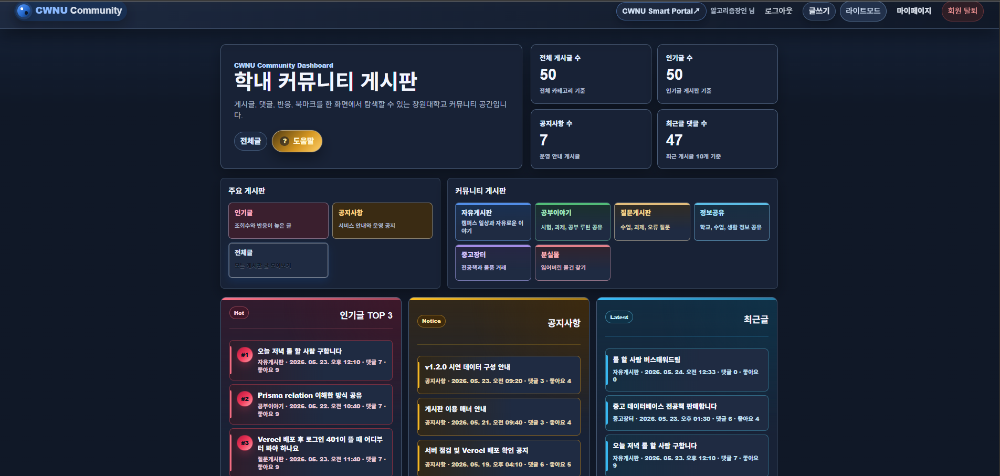 |
|:--:|:--:|
| **▲ 라이트모드 대표 화면** | **▲ 다크모드** |

| 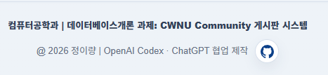 |
|:--:|
| **▲ footer** |

### 검증 내용

- 각 페이지에서 테마 전환 버튼이 보이는지 확인함.
- 새로고침 후에도 선택한 테마 유지 여부 확인.
- 다크모드에서 텍스트, 버튼, 테이블, footer 가독성 확인.
- hover 효과가 레이아웃을 깨지 않는지 확인함.
- Toast와 Confirm Modal이 다크모드와 모바일에서 화면 밖으로 밀리지 않는지 확인.
- Skeleton Loading과 spinner가 reduced-motion 환경에서 과하게 동작하지 않는지 확인.
- 모바일 Floating 글쓰기 버튼이 footer, toast, modal과 z-index 충돌 없이 표시되는지 확인.

---

## 15. 개발용 seed 데이터

### 기능 설명

개발 및 기능 설명서 캡처를 위해 테스트 데이터를 자동 생성하는 seed 스크립트를 제공함. v2.0.0 후보 기준 seed는 loginId 기반 테스트 계정과 함께 메인 대시보드, 인기글 TOP 3, 공지사항, 최근글, 검색 하이라이트, 마이페이지 활동 시각화가 자연스럽게 보이도록 재구성함.

### 동작 방식

- 실행 시 기존 데이터를 삭제한 뒤 새 더미 데이터를 생성함.
- 삭제 순서는 외래키 관계를 고려함.
- `NODE_ENV=production`이면 실행을 중단함.
- `--confirm` 인자가 없으면 실행을 중단함.
- 테스트 계정의 비밀번호는 모두 `test1234!`임.
- 테스트 사용자는 10명으로 구성함.
- 게시글은 49개이며 `notice/free/study/question/info/market/lost` 각 7개씩 구성함.
- 댓글 148개, 답글 62개, 좋아요 224개, 싫어요 41개, 북마크 192개를 포함함.
- 대표 시연 계정은 `assignment` / `과제폭격기`이며 비밀번호는 `test1234!`임.
- 검색 시연을 위해 `Prisma`, `SQL`, `셔틀`, `분실`, `중고`, `롤`, `고양이`, `배포` 키워드를 자연스럽게 포함함.
- 일부 글/댓글은 익명 작성과 수정일을 포함해 익명 배지와 수정됨 표시를 확인할 수 있게 구성함.

### 관련 API 또는 DB

| 파일 | 설명 |
|---|---|
| `scripts/seed-dev.js` | 개발용 데이터 초기화/생성 |
| User | 테스트 사용자 |
| Post | 카테고리별 게시글 |
| Comment | 댓글/답글 |
| Like/Dislike/Bookmark | 반응 데이터 |

### 관련 코드

관련 파일: `scripts/seed-dev.js`

```js
function assertSafeToRun() {
  if (process.env.NODE_ENV === "production") {
    console.error("Refusing to seed development data while NODE_ENV is production.");
    process.exit(1);
  }

  if (!process.argv.includes("--confirm")) {
    console.error("This script deletes existing data before seeding.");
    console.error("Run with: npm run db:seed:dev -- --confirm");
    process.exit(1);
  }
}
```

관련 파일: `scripts/seed-dev.js`

```js
const PASSWORD = "test1234!";
const SALT_ROUNDS = 12;

const users = [
  { loginId: "algorithm", nickname: "알고리즘장인" },
  { loginId: "library", nickname: "새벽도서관" },
  { loginId: "campuscat", nickname: "캠퍼스고양이" },
  { loginId: "assignment", nickname: "과제폭격기" },
  { loginId: "dbmaster", nickname: "DB마스터" },
];
```

관련 파일: `scripts/seed-dev.js`

```js
console.log(`users count: ${summary.users}`);
console.log(`posts count: ${summary.posts}`);
console.log(`comments count: ${summary.comments}`);
console.log(`replies count: ${summary.replies}`);
console.log(`likes count: ${summary.likes}`);
console.log(`dislikes count: ${summary.dislikes}`);
console.log(`bookmarks count: ${summary.bookmarks}`);
```

### 관련 화면

- seed 실행 후 전체 UI 화면
- Prisma Studio 데이터 확인 화면

| 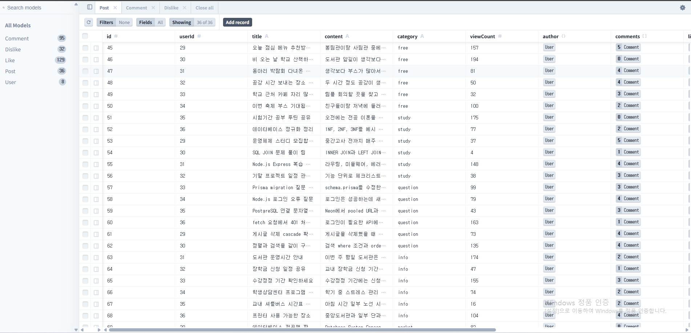 |
|:--:|
| **▲ seed 데이터 목록** |

### 검증 내용

- `node --check scripts/seed-dev.js`가 통과하는지 확인함.
- `npm run db:seed:dev -- --confirm` 실행 후 데이터 생성 여부 확인.
- production 환경에서는 실행이 차단되는지 확인함.
- 메인 목록과 카테고리별 게시글이 정상 표시 여부 확인.
- README의 seed 데이터 수치와 `scripts/seed-dev.js` 요약 출력이 일치하는지 확인.
- 대표 시연 계정 로그인 시 작성 글, 댓글/답글, 좋아요, 싫어요, 북마크 활동이 마이페이지에 표시되는지 확인.

---

## 16. DB cascade 삭제 검증

### 기능 설명

게시글 삭제와 회원 탈퇴 시 연결된 데이터가 남지 않도록 cascade 삭제를 검증함.

### 동작 방식

- Post 삭제 시 Comment, Like, Dislike, Bookmark가 함께 삭제됨.
- User 삭제 시 해당 사용자가 작성한 Post, Comment와 반응 데이터가 삭제됨.
- 부모 댓글 삭제 시 연결된 답글도 삭제됨.
- 회원 탈퇴는 현재 로그인 사용자 기준으로 처리하며 프론트에서 userId를 받지 않음.

### 관련 API 또는 DB

| 삭제 상황 | 관련 API | 관련 DB |
|---|---|---|
| 게시글 삭제 | `DELETE /api/posts/:id` | Post, Comment, Like, Dislike, Bookmark |
| 회원 탈퇴 | `DELETE /api/auth/me` | User, Post, Comment, Like, Dislike, Bookmark |
| 댓글 삭제 | `DELETE /api/comments/:id` | Comment self relation |

### 관련 코드

관련 파일: `prisma/schema.prisma`

```prisma
model Comment {
  id       Int      @id @default(autoincrement())
  postId   Int      @map("post_id")
  userId   Int      @map("user_id")
  parentId Int?     @map("parent_id")
  post     Post     @relation(fields: [postId], references: [id], onDelete: Cascade)
  author   User     @relation(fields: [userId], references: [id], onDelete: Cascade)
  parent   Comment? @relation("CommentReplies", fields: [parentId], references: [id], onDelete: Cascade)
  replies  Comment[] @relation("CommentReplies")
}
```

관련 파일: `server/controllers/post.controller.js`

```js
await prisma.post.delete({
  where: { id: postId },
});
```

관련 파일: `server/controllers/auth.controller.js`

```js
await prisma.$transaction(async (tx) => {
  await tx.post.deleteMany({ where: { userId } });
  await tx.comment.deleteMany({ where: { userId } });
  await tx.like.deleteMany({ where: { userId } });
  await tx.dislike.deleteMany({ where: { userId } });
  await tx.bookmark.deleteMany({ where: { userId } });
  await tx.user.delete({ where: { id: userId } });
});
```

### 관련 화면

- 게시글 상세 화면
- 마이페이지 회원 탈퇴 영역
- Prisma Studio

| 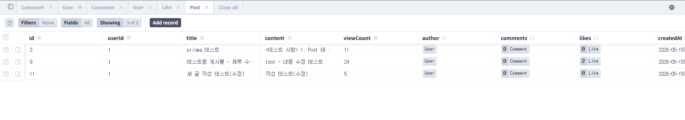 | 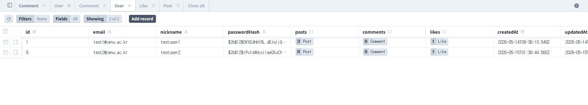 |
|:--:|:--:|
| **▲ 게시글 삭제 전후 DB** | **▲ 회원 탈퇴 전후 DB** |

### 검증 내용

- 게시글 삭제 후 해당 게시글의 댓글/답글/좋아요/싫어요/북마크가 남지 않는지 확인함.
- 회원 탈퇴 후 사용자의 게시글/댓글/반응/북마크 삭제 여부 확인.
- 다른 사용자의 게시글은 회원 탈퇴 후에도 유지 여부 확인.
- 부모 댓글 삭제 후 답글 함께 삭제 여부 확인.

---

## 17. AI 활용 명시

### 기능 설명

프로젝트 구현 및 문서 정리 과정에서 AI 도구를 활용함. 과제 제출 시 AI 활용 사실과 활용 범위를 명시함.

### 동작 방식

- 구현 전략 수립과 코드 작성 보조에 AI를 활용함.
- UI/UX 개선, 오류 분석, README 정리, 테스트 체크리스트 작성에 AI를 활용함.
- 최종 기능 동작과 제출 문서는 제출자가 직접 검토함.

### 관련 API 또는 DB

- 관련 API 없음
- 관련 DB 없음

### 관련 화면

- README 부록의 AI 활용 명시
- 별도 문서 작성 시 `docs/ai-usage.md`

별도 화면 캡처 없음. AI 활용 사실은 README 부록과 `docs/ai-usage.md` 문서로 제출함.

### 검증 내용

- README에 AI 활용 도구와 활용 범위가 명시되어 있는지 확인함.
- 실제 프롬프트 전문이나 민감정보를 임의로 작성하지 않았는지 확인함.
- AI 결과물을 제출자가 검토했다는 점이 문서에 포함되어 있는지 확인함.

---

## 18. 모바일 뷰포트 최적화

### 기능 설명

모바일 환경에서 주요 화면이 화면 밖으로 밀리거나 깨지지 않도록 반응형 레이아웃을 적용함. 헤더, 게시판 바로가기, 검색/정렬/표시 개수, 게시글 목록, 상세 화면, 댓글/답글, 폼, 마이페이지, footer를 모바일 기준으로 보완함. v1.2.0 기준으로 모바일 카드형 게시글 목록과 Floating 글쓰기 버튼을 제공함.

### 동작 방식

- CSS media query를 사용해 화면 폭이 좁을 때 padding, grid, flex-wrap, table scroll, button layout을 조정함.
- 게시글 목록 테이블은 가로 스크롤을 허용해 모바일에서 전체 레이아웃이 깨지지 않도록 구성함.
- 헤더와 footer는 버튼이 겹치지 않도록 줄바꿈과 간격을 조정함.
- 마이페이지 탭은 모바일에서 가로 스크롤이 가능하도록 처리함.
- 다크모드에서도 모바일 색상과 버튼 시인성을 유지함.
- 모바일 기본 경험은 게시글 카드형 목록 중심으로 구성하고, 필요 시 표 보기로 전환할 수 있음.
- 카드형 목록에는 카테고리, 제목, 작성자, 등록일, 수정일, 조회수, 댓글, 좋아요, 싫어요를 요약 표시함.
- 모바일 Floating 글쓰기 버튼은 우측 하단에 고정해 목록 스크롤 중에도 글쓰기 접근성을 유지함.
- 검색/최근 검색어 chip, filter summary, result summary는 좁은 화면에서 줄바꿈되도록 구성함.

### 관련 API 또는 DB

- 별도 API 없음
- 별도 DB 없음
- CSS 기반 UI/UX 개선

### 관련 코드

관련 파일: `public/css/style.css`

```css
@media (max-width: 768px) {
  .site-header {
    gap: 12px;
    padding: 14px 12px;
  }

  .nav-links {
    align-items: stretch;
    gap: 8px;
  }

  .nav-links a,
  .link-button {
    flex: 1 1 auto;
    min-height: 38px;
    text-align: center;
  }
}
```

관련 파일: `public/css/style.css`

```css
@media (max-width: 768px) {
  .shortcut-links {
    display: grid;
    grid-template-columns: repeat(2, minmax(0, 1fr));
  }

  .post-table {
    min-width: 760px;
    font-size: 13px;
  }

  .post-card-list {
    display: grid;
    grid-template-columns: 1fr;
  }

  .mypage-tabs {
    flex-wrap: nowrap;
    overflow-x: auto;
    padding-bottom: 4px;
  }
}
```

### 관련 화면

- `public/index.html`
- `public/post-detail.html`
- `public/post-write.html`
- `public/login.html`
- `public/register.html`
- `public/mypage.html`

|  | 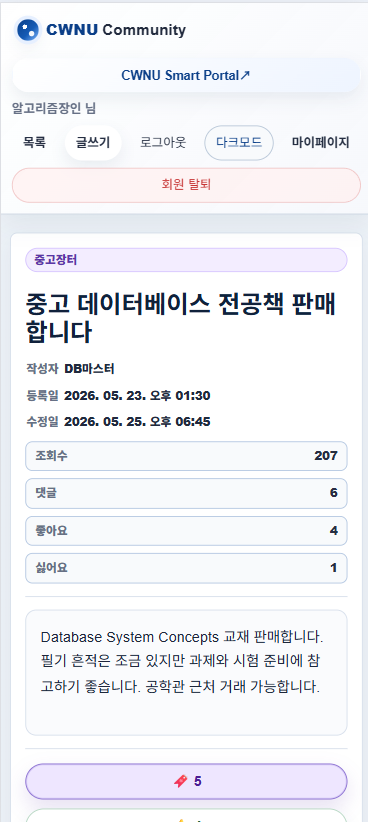 |
|:--:|:--:|
| **▲ 모바일 메인 대시보드 흐름** | **▲ 모바일 게시글 상세 화면** |

|  |  |
|:--:|:--:|
| **▲ 모바일 마이페이지** | **▲ 모바일 다크모드** |

### 검증 내용

- Chrome DevTools 모바일 뷰포트에서 메인, 목록, 상세, 로그인/회원가입, 글쓰기/수정, 마이페이지 화면 확인.
- 게시판 바로가기 버튼이 모바일에서 2열 또는 1열로 자연스럽게 배치되는지 확인.
- 검색/정렬/표시 개수 영역이 모바일에서 화면 밖으로 밀리지 않는지 확인.
- 게시글 목록 테이블이 모바일에서 가로 스크롤로 표시되는지 확인.
- 모바일 카드형 게시글 목록이 기본 보기로 자연스럽게 표시되는지 확인.
- 카드 제목 클릭 또는 카드 선택으로 상세 페이지 이동 여부 확인.
- Floating 글쓰기 버튼이 모바일 360px/768px에서 footer와 겹치지 않는지 확인.
- footer와 Smart Portal/GitHub 링크가 겹치지 않는지 확인.
- 모바일 다크모드에서 텍스트와 버튼 시인성 확인.

---

## 19. v1.2.0 UI/UX 확장 정리

### 기능 설명

v1.2.0은 기존 DBMS 게시판 기능 위에 서비스형 UI/UX를 보강한 확장 버전임. 기능 수를 단순히 늘리기보다 사용자가 메인에서 정보를 탐색하고, 글을 작성하고, 상세 내용을 읽고, 자신의 활동을 확인하는 흐름을 더 자연스럽게 만드는 데 중점을 둠.

### 동작 방식

- 메인 화면은 커뮤니티 대시보드, 인기글/공지사항/최근글 프리뷰, 최근 본 게시글 영역으로 구성함.
- 검색 영역은 검색어 지우기, 최근 검색어, 하이라이트, filter summary, result summary를 제공함.
- 목록은 표 보기와 카드 보기를 모두 지원하고, 모바일에서는 카드형 목록 중심으로 표시함.
- 글쓰기 화면은 카테고리별 가이드, 글자 수 카운터, 미리보기, 임시저장, 나가기 경고를 제공함.
- 상세 화면은 2줄 메타 구조, 댓글 이동, 맨 위 이동, 읽기 진행 보조 UI, 추천 게시글을 제공함.
- 마이페이지는 프로필/통계/최근 활동/활동 시각화/탭별 목록을 함께 제공함.
- Toast, Confirm Modal, Skeleton Loading, spinner, 버튼 pending, Floating 글쓰기 버튼을 통해 상태 피드백을 강화함.

### 관련 API 또는 DB

| 기능 | 데이터 출처 |
|---|---|
| 메인 대시보드/프리뷰 | `GET /api/posts`, `board=hot`, `board=notice`, `sort=latest` |
| 검색/정렬/페이징 | `GET /api/posts` query |
| 상세 추천 | `GET /api/posts`, 현재 post category, hot board |
| 마이페이지 활동 시각화 | `GET /api/auth/me/activity` |
| 글쓰기 UX | 클라이언트 localStorage draft |
| 최근 검색어/최근 본 글/보기 모드 | 클라이언트 localStorage |

### 관련 코드

관련 파일: `public/js/posts.js`

```js
const VIEW_MODE_STORAGE_KEY = "cwnu.community.viewMode";
const RECENT_POSTS_STORAGE_KEY = "cwnu.community.recentPosts";
const RECENT_SEARCHES_STORAGE_KEY = "cwnu.community.recentSearches";
const POST_DRAFT_STORAGE_KEY = "cwnu.community.postDraft";
```

관련 파일: `public/js/mypage.js`

```js
renderProfile(normalizedActivity.user);
renderActivityStats(normalizedActivity);
renderRecentActivities(normalizedActivity);
renderActivityVisuals(normalizedActivity);
```

### 관련 화면

- `public/index.html`
- `public/post-write.html`
- `public/post-detail.html`
- `public/mypage.html`

|  |  |
|:--:|:--:|
| **▲ 메인 대시보드 탐색 흐름** | **▲ 검색/필터/table-card 보기 전환** |

|  |  |
|:--:|:--:|
| **▲ 글쓰기 UX 흐름** | **▲ 마이페이지 활동 시각화** |

### 검증 내용

- 메인 대시보드, 프리뷰 패널, 최근 본 게시글이 데이터 로딩 후 정상 표시되는지 확인.
- 검색어 지우기, 최근 검색어, 하이라이트, table/card 보기 전환이 동시에 동작하는지 확인.
- 글쓰기 임시저장이 새 글 작성 모드에서만 동작하고 작성 성공 후 삭제되는지 확인.
- 상세 화면의 댓글 이동, 맨 위 이동, 추천 게시글, 반응 버튼이 기존 기능과 충돌하지 않는지 확인.
- 마이페이지 활동 타임라인과 많이 활동한 게시판이 `/api/auth/me/activity` 응답 기준으로 표시되는지 확인.
- 다크모드, 모바일 360px/768px, reduced motion에서 UI가 깨지지 않는지 확인.

---

## 20. 결론

### 기능 설명

본 프로젝트는 데이터베이스개론 과제 요구사항을 충족하는 Node.js 기반 DBMS 웹 게시판임. 필수 기능 외에도 카테고리, 공지사항, 인기글, 댓글 답글, 익명 작성, 북마크, 마이페이지, 다크모드, 도움말 투어, Toast, Confirm Modal, Skeleton Loading, 글쓰기 UX, 검색 UX, 활동 시각화 등을 추가하여 실제 커뮤니티 서비스에 가까운 형태로 확장함.

### 동작 방식

- 프론트엔드는 정적 HTML/CSS/Vanilla JS로 구성함.
- 서버는 Express REST API로 구성함.
- 데이터는 PostgreSQL과 Prisma ORM으로 관리함.
- 인증은 JWT httpOnly cookie로 유지함.
- 배포는 Vercel 서버리스 Express 구조를 고려함.

### 관련 API 또는 DB

- 전체 API: `server/routes/`
- 전체 DB 모델: `prisma/schema.prisma`
- 환경변수 예시: `.env.example`
- 배포 설정: `vercel.json`, `api/index.js`

### 관련 화면

- 전체 주요 페이지
- 기능 설명서용 최종 캡처 화면

|  |  |
|:--:|:--:|
| **▲ 최종 메인 화면** | **▲ 최종 상세 화면** |

|  |
|:--:|
| **▲ 최종 마이페이지** |

### 검증 내용

- 과제 필수 기능이 모두 동작 여부 확인.
- 게시글 삭제와 회원 탈퇴 시 cascade 삭제가 정상 동작 여부 확인.
- 로그인, 권한 검증, 익명 표시, 반응 전환이 정상 동작 여부 확인.
- README와 기능 설명서의 기능 설명이 실제 구현과 충돌하지 않는지 확인함.

