# CWNU Community 기능 설명서

데이터베이스개론 과제 제출용 기능 설명서임. 본 문서는 `DatabaseLanguage_NodeJS_CWNU-Community` 프로젝트의 페이지별 기능, 동작 방식, 관련 API/DB, 캡처 위치, 검증 내용을 정리함.

> 이 문서는 `docs/feature-guide.md`에 위치하므로, 이미지 경로는 `docs` 폴더 기준 상대경로인 `./screenshots/...` 형식으로 작성함.

## 1. 프로젝트 개요

### 기능 설명

`CWNU Community`는 국립창원대학교 구성원을 위한 학내 커뮤니티 게시판 시스템임. 기존 `CWNU Smart Portal`의 확장 서비스로 기획했으나, 데이터베이스개론 과제 제출을 위해 별도 레포지토리와 별도 배포 프로젝트로 구성함.

### 동작 방식

- 사용자는 정적 HTML 화면에서 게시글, 댓글, 반응 기능을 사용함.
- 프론트엔드는 `fetch()`로 REST API를 호출함.
- 서버는 Express에서 요청을 처리하고 Prisma Client로 PostgreSQL에 접근함.
- 인증은 JWT를 httpOnly cookie에 저장하는 방식으로 유지함.

### 관련 API 또는 DB

| 구분 | 내용 |
|---|---|
| 서버 | Node.js + Express |
| DBMS | PostgreSQL |
| ORM | Prisma ORM |
| 인증 | JWT httpOnly cookie |
| 주요 DB 모델 | User, Post, Comment, Like, Dislike, Bookmark |

### 관련 코드

관련 파일: `server/app.js`

```js
app.use(express.json());
app.use(express.urlencoded({ extended: true }));
app.use(cookieParser());

app.use(express.static(path.join(__dirname, "..", "public")));

app.get("/api/health", (req, res) => {
  res.json({
    status: "ok",
    service: "DatabaseLanguage_NodeJS_CWNU-Community",
  });
});

app.use("/api/auth", authRoutes);
app.use("/api/posts", postRoutes);
app.use("/api", commentRoutes);
app.use("/api", likeRoutes);
app.use("/api", dislikeRoutes);
app.use("/api", bookmarkRoutes);
```

관련 파일: `api/index.js`

```js
const app = require("../server/app");

module.exports = app;
```

### 관련 화면

- `public/index.html`
- `public/login.html`
- `public/register.html`
- `public/post-detail.html`
- `public/post-write.html`
- `public/mypage.html`

| 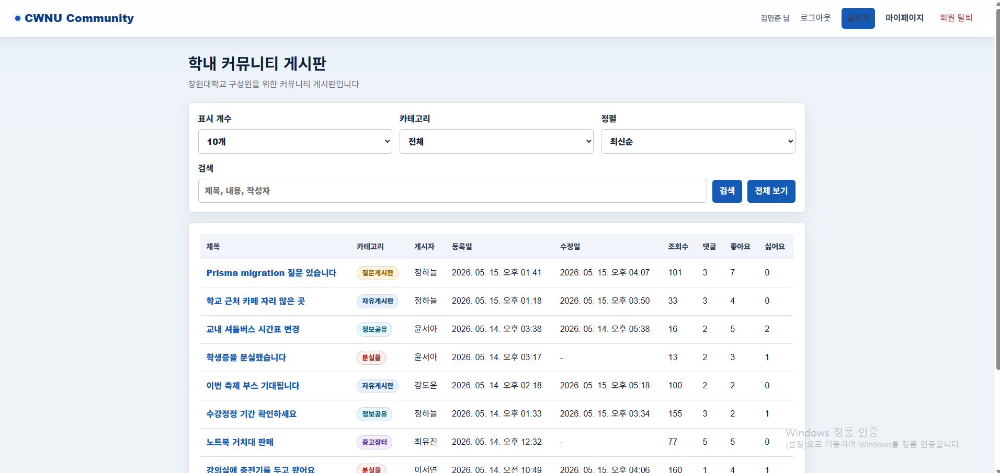 |
|:--:|
| **▲ 메인 게시판** |

### 검증 내용

- `/api/health`가 정상 응답하는지 확인함.
- 메인 페이지에서 게시글 목록 표시 여부 확인.
- 로그인/비로그인 상태에서 헤더 표시가 달라지는지 확인함.

---

## 2. 기술 스택

### 기능 설명

프로젝트는 Node.js 기반 서버와 정적 프론트엔드로 구성함. EJS는 사용하지 않고 HTML/CSS/Vanilla JS와 REST API 호출 방식으로 구현함.

### 동작 방식

| 영역 | 사용 기술 | 설명 |
|---|---|---|
| Runtime | Node.js | 서버 실행 환경 |
| Server | Express.js | REST API와 정적 파일 제공 |
| DBMS | PostgreSQL | 사용자, 게시글, 댓글, 반응 데이터 저장 |
| ORM | Prisma ORM | DB 모델과 query 관리 |
| Auth | JWT + httpOnly cookie | 로그인 유지 |
| Password | bcrypt | 비밀번호 hash 저장 |
| Frontend | HTML/CSS/Vanilla JS | EJS 없이 정적 화면 구성 |
| API | `fetch()` | 클라이언트에서 REST API 호출 |

### 관련 API 또는 DB

- `server/app.js`: Express 앱 설정
- `api/index.js`: Vercel 서버리스 진입점
- `server/prisma.js`: Prisma Client 연결
- `prisma/schema.prisma`: DB 모델 정의

### 관련 코드

관련 파일: `package.json`

```json
"scripts": {
  "dev": "nodemon server.js",
  "start": "node server.js",
  "prisma:generate": "prisma generate",
  "prisma:migrate": "prisma migrate dev",
  "prisma:studio": "prisma studio",
  "db:seed:dev": "node scripts/seed-dev.js",
  "postinstall": "prisma generate"
}
```

관련 파일: `server/prisma.js`

```js
const { PrismaClient } = require("@prisma/client");

const prisma = new PrismaClient();

module.exports = prisma;
```

### 관련 화면

- 전체 HTML 페이지
- 전체 JavaScript 파일


### 검증 내용

- `npm install` 후 의존성이 설치 여부 확인.
- `npm run prisma:generate` 정상 실행 여부 확인.
- `npm run dev`로 로컬 서버 실행 여부 확인.

---

## 3. DBMS/ORM 사용 설명

### 기능 설명

PostgreSQL을 DBMS로 사용하고 Prisma ORM을 통해 모델, relation, unique 제약, cascade 삭제 정책을 관리함.

### 동작 방식

- Prisma datasource는 `DATABASE_URL`과 `DIRECT_URL` 환경변수를 사용함.
- `DATABASE_URL`은 애플리케이션 query에 사용함.
- `DIRECT_URL`은 migration을 위한 직접 연결에 사용함.
- Prisma migration 파일은 `prisma/migrations/`에 보관함.

### 관련 API 또는 DB

| 모델 | 역할 | 주요 관계 |
|---|---|---|
| User | 사용자 계정 | Post, Comment, Like, Dislike, Bookmark와 1:N |
| Post | 게시글 | User에 속하고 Comment, Like, Dislike, Bookmark 보유 |
| Comment | 댓글/답글 | Post/User에 속하고 parentId로 1단계 답글 구성 |
| Like | 좋아요 | `postId + userId` unique |
| Dislike | 싫어요 | `postId + userId` unique |
| Bookmark | 북마크 | `postId + userId` unique |

### 관련 코드

관련 파일: `prisma/schema.prisma`

```prisma
datasource db {
  provider  = "postgresql"
  url       = env("DATABASE_URL")
  directUrl = env("DIRECT_URL")
}

model Post {
  id        Int       @id @default(autoincrement())
  userId    Int       @map("user_id")
  title     String
  content   String
  category  String    @default("free")
  isAnonymous Boolean @default(false) @map("is_anonymous")
  author    User      @relation(fields: [userId], references: [id], onDelete: Cascade)
  comments  Comment[]
  likes     Like[]
  dislikes  Dislike[]
  bookmarks Bookmark[]
}
```

관련 파일: `prisma/schema.prisma`

```prisma
model Like {
  id     Int @id @default(autoincrement())
  postId Int @map("post_id")
  userId Int @map("user_id")
  post   Post @relation(fields: [postId], references: [id], onDelete: Cascade)
  user   User @relation(fields: [userId], references: [id], onDelete: Cascade)

  @@unique([postId, userId])
  @@map("likes")
}
```

### 관련 화면

- Prisma Studio 확인 화면
- 게시글 목록/상세 화면
- 마이페이지 활동 목록

|  |
|:--:|
| **▲ Prisma Studio 모델 확인** |

### 검증 내용

- `npx prisma validate`로 schema 유효성을 확인함.
- `npx prisma migrate dev`로 개발 DB migration 적용 여부 확인.
- 게시글 삭제 시 연결된 댓글, 좋아요, 싫어요, 북마크가 남지 않는지 확인함.

---

## 4. 회원가입 / 로그인 / 로그아웃

### 기능 설명

사용자는 이메일, 닉네임, 비밀번호로 회원가입할 수 있고, 로그인 후 JWT httpOnly cookie로 인증 상태가 유지됨.

### 동작 방식

- 회원가입 시 이메일과 닉네임 중복을 검사함.
- 비밀번호는 bcrypt로 hash 처리하여 저장함.
- 로그인 성공 시 JWT를 httpOnly cookie에 저장함.
- 로그아웃 시 인증 cookie를 제거함.
- `/api/auth/me`로 현재 로그인 상태를 확인함.

### 관련 API 또는 DB

| Method | Endpoint | 설명 |
|---|---|---|
| POST | `/api/auth/register` | 회원가입 |
| POST | `/api/auth/login` | 로그인 |
| POST | `/api/auth/logout` | 로그아웃 |
| GET | `/api/auth/me` | 현재 사용자 조회 |

| DB 모델 | 관련 필드 |
|---|---|
| User | `email`, `nickname`, `passwordHash`, `createdAt` |

### 관련 코드

관련 파일: `server/controllers/auth.controller.js`

```js
const passwordHash = await bcrypt.hash(password, SALT_ROUNDS);
const user = await prisma.user.create({
  data: {
    email,
    nickname,
    passwordHash,
  },
});

const token = signAuthToken(user);
setAuthCookie(res, token);
```

관련 파일: `server/controllers/auth.controller.js`

```js
const isPasswordValid = await bcrypt.compare(password, user.passwordHash);

if (!isPasswordValid) {
  return res.status(401).json({ message: "Invalid email or password." });
}

const token = signAuthToken(user);
setAuthCookie(res, token);
```

관련 파일: `server/utils/authCookie.js`

```js
function setAuthCookie(res, token) {
  res.cookie(COOKIE_NAME, token, getCookieOptions());
}

function clearAuthCookie(res) {
  const { maxAge, ...options } = getCookieOptions();
  res.clearCookie(COOKIE_NAME, options);
}
```

### 관련 화면

- `public/register.html`
- `public/login.html`
- `public/index.html` 상단 사용자 영역

|  | 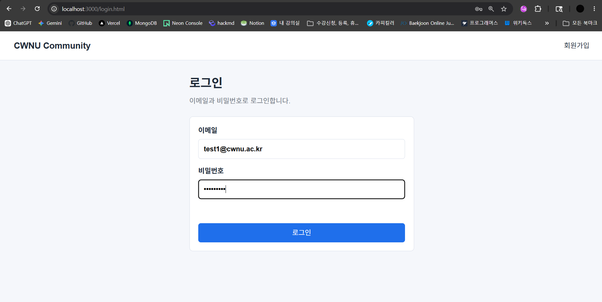 |
|:--:|:--:|
| **▲ 회원가입 화면** | **▲ 로그인 화면** |

|  |
|:--:|
| **▲ 로그인 후 헤더** |

### 검증 내용

- 새 계정으로 회원가입이 되는지 확인함.
- 같은 이메일 또는 같은 닉네임으로 중복 가입 거부 여부 확인.
- 로그인 후 헤더에 사용자 닉네임 표시 여부 확인.
- 로그아웃 후 `/api/auth/me`가 비로그인 상태를 반환하는지 확인함.

---

## 5. 비밀번호 보기 / 닉네임 변경 / 회원 탈퇴

### 기능 설명

회원가입/로그인 화면에서는 비밀번호 보기/숨기기를 지원함. 로그인 사용자는 마이페이지에서 닉네임을 변경하거나 계정을 탈퇴할 수 있음.

### 동작 방식

- 비밀번호 보기 버튼은 input type을 `password`와 `text`로 전환함.
- 닉네임 변경은 로그인 사용자 본인의 `User.nickname`만 수정함.
- 닉네임은 trim 처리 후 2자 이상 20자 이하로 검증함.
- 회원 탈퇴 시 현재 로그인 사용자 기준으로 계정과 관련 데이터를 삭제하고 인증 cookie를 제거함.

### 관련 API 또는 DB

| Method | Endpoint | 설명 |
|---|---|---|
| PATCH | `/api/auth/me` | 닉네임 변경 |
| DELETE | `/api/auth/me` | 회원 탈퇴 |
| GET | `/api/auth/me/activity` | 마이페이지 활동 조회 |

| DB 모델 | 관련 필드 |
|---|---|
| User | `nickname`, `email`, `createdAt` |
| Post/Comment/Like/Dislike/Bookmark | 회원 탈퇴 시 정리 대상 |

### 관련 코드

관련 파일: `public/js/auth.js`

```js
function bindPasswordToggles() {
  document.querySelectorAll("[data-password-toggle]").forEach((button) => {
    const label = button.closest("label");
    const passwordInput = label?.querySelector('input[type="password"], input[type="text"][name="password"]');

    button.addEventListener("click", () => {
      const isHidden = passwordInput.type === "password";
      passwordInput.type = isHidden ? "text" : "password";
      button.textContent = isHidden ? "비밀번호 숨기기" : "비밀번호 보기";
    });
  });
}
```

관련 파일: `server/controllers/auth.controller.js`

```js
const user = await prisma.user.update({
  where: { id: req.user.id },
  data: { nickname },
  select: {
    id: true,
    email: true,
    nickname: true,
    createdAt: true,
  },
});
```

관련 파일: `server/controllers/auth.controller.js`

```js
await prisma.$transaction(async (tx) => {
  await tx.post.deleteMany({ where: { userId } });
  await tx.comment.deleteMany({ where: { userId } });
  await tx.like.deleteMany({ where: { userId } });
  await tx.dislike.deleteMany({ where: { userId } });
  await tx.bookmark.deleteMany({ where: { userId } });
  await tx.user.delete({ where: { id: userId } });
});
```

### 관련 화면

- `public/register.html`
- `public/login.html`
- `public/mypage.html`

|  | 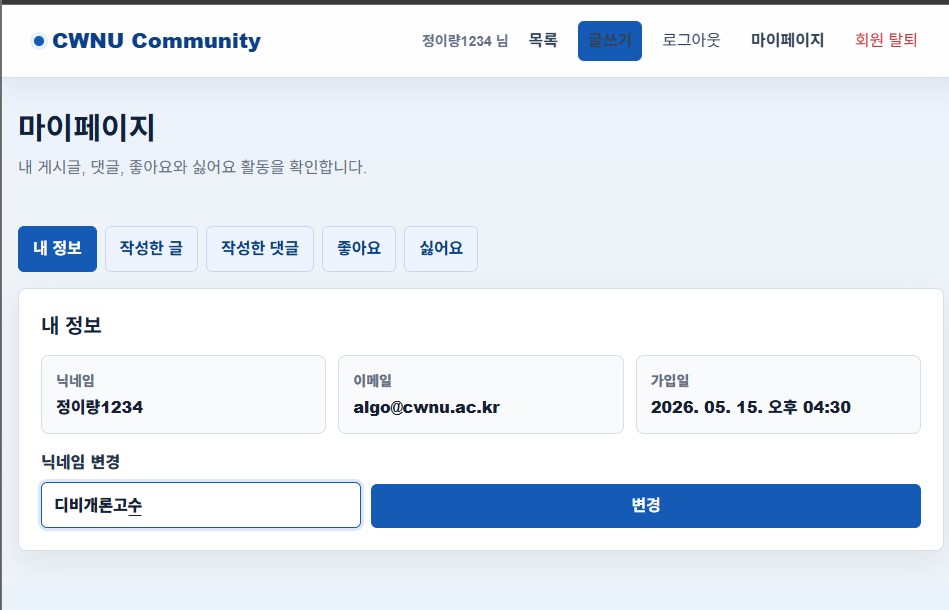 |
|:--:|:--:|
| **▲ 비밀번호 보기 숨기기** | **▲ 닉네임 변경** |

|  |
|:--:|
| **▲ 회원 탈퇴 확인** |

### 검증 내용

- 비밀번호 보기/숨기기 버튼이 정상 전환되는지 확인함.
- 닉네임 변경 후 헤더와 마이페이지에 변경된 닉네임 표시 여부 확인.
- 비로그인 상태에서 닉네임 변경 API 요청 시 401 반환 여부 확인.
- 회원 탈퇴 후 로그인 상태가 해제되고 사용자 데이터 삭제 여부 확인.

---

## 6. 게시글 목록 / 게시판 / 공지사항 / 인기글

### 기능 설명

메인 페이지에서는 전체글, 인기글, 공지사항, 카테고리 게시판을 볼 수 있음. Smart Portal 연계 시 특정 게시판 URL로 직접 이동할 수 있도록 query parameter 기반 진입을 지원함.

### 동작 방식

- 전체글, 인기글, 공지사항, 자유게시판, 공부이야기, 질문게시판, 정보공유, 중고장터, 분실물은 게시판 바로가기 영역에서 이동 가능함.
- `board` query와 `category` query를 통해 게시판별 목록을 조회함.
- `/?board=hot`은 hotScore 기준 인기글을 표시함.
- `/?board=notice`는 공지사항 게시판을 표시함.
- Smart Portal 연계 시 중고장터와 분실물은 각각 `/?category=market`, `/?category=lost`로 연결 가능함.
- 게시글 목록에는 제목, 카테고리, 작성자, 등록일, 수정일, 조회수, 댓글 수, 좋아요 수, 싫어요 수가 표시됨.

### 관련 API 또는 DB

| Method | Endpoint | 설명 |
|---|---|---|
| GET | `/api/posts` | 게시글 목록 조회 |

| Query | 설명 |
|---|---|
| `board=hot` | 인기글 |
| `board=notice` | 공지사항 |
| `category=free/study/question/info/market/lost` | 카테고리 게시판 |

| DB 모델 | 관련 필드 |
|---|---|
| Post | `category`, `viewCount`, `createdAt`, `updatedAt` |
| Comment/Like/Dislike | 목록 count 표시 |

### 관련 코드

관련 파일: `server/controllers/post.controller.js`

```js
const ALLOWED_BOARDS = ["all", "hot", "notice"];
const ALLOWED_CATEGORIES = ["notice", "free", "study", "question", "info", "market", "lost"];

const effectiveCategory = board === "notice" ? "notice" : category;
const where = getPostSearchWhere(q, effectiveCategory);

if (board === "hot") {
  const sortedPosts = posts
    .map((post) => ({
      ...post,
      hotScore: post.viewCount + post._count.likes * 10 + post._count.comments * 5 - post._count.dislikes * 3,
    }))
    .sort((a, b) => b.hotScore - a.hotScore || b.createdAt.getTime() - a.createdAt.getTime());
}
```

관련 파일: `public/js/posts.js`

```js
function initializeCategoryFilterFromQuery() {
  const query = new URLSearchParams(window.location.search);
  const categoryFromQuery = query.get("category") || "all";
  const boardFromQuery = query.get("board") || "all";

  if (ALLOWED_BOARDS.includes(boardFromQuery)) {
    postState.board = boardFromQuery;
  }
}
```

### 관련 화면

- `public/index.html`

|  | 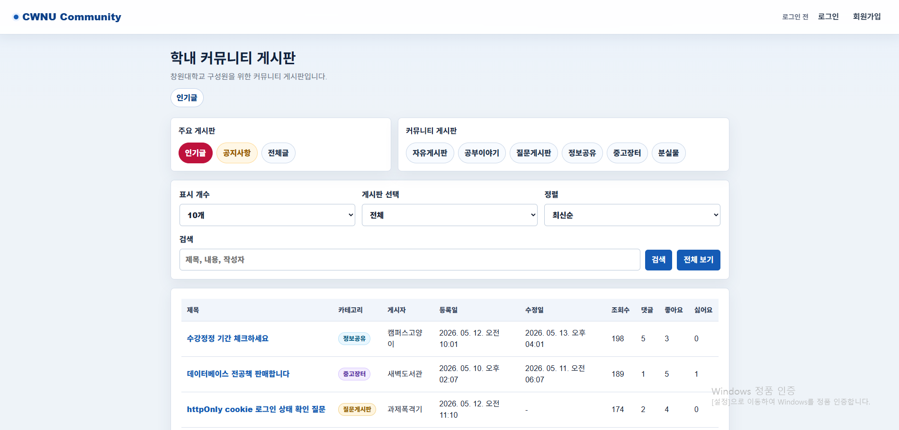 |
|:--:|:--:|
| **▲ 메인 게시판** | **▲ 인기글 게시판** |

| 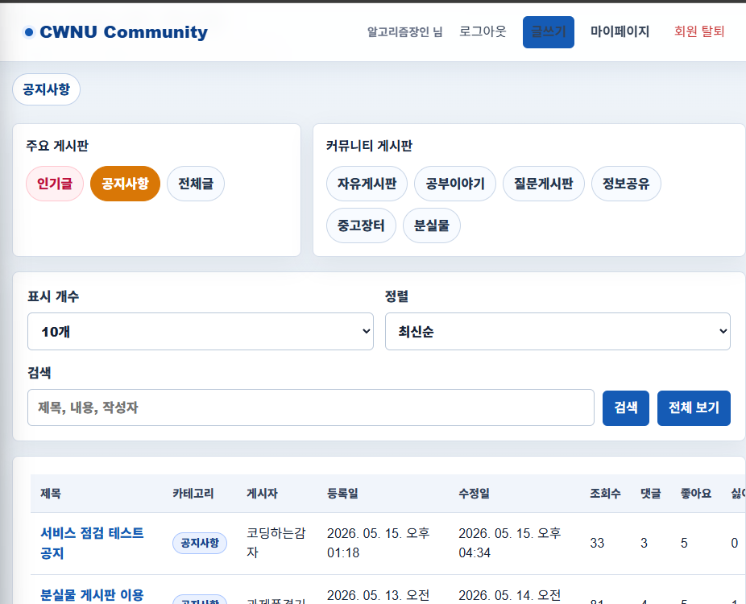 | 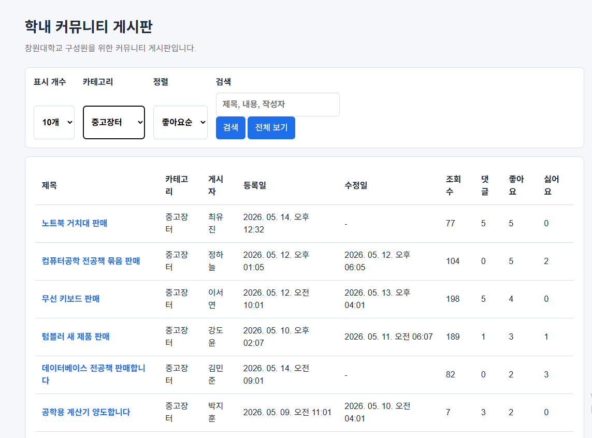 |
|:--:|:--:|
| **▲ 공지사항 게시판** | **▲ 중고장터 게시판** |

### 검증 내용

- `/`에서 전체글 표시 여부 확인.
- `/?board=hot`에서 인기글이 hotScore 기준으로 표시 여부 확인.
- `/?board=notice`에서 공지사항 글만 표시 여부 확인.
- `/?category=market`, `/?category=lost`가 Smart Portal 연계 URL로 사용 가능 여부 확인.

---

## 7. 검색 / 정렬 / 페이징

### 기능 설명

게시글 목록에서는 검색어, 정렬, 표시 개수, 페이지 이동을 지원함.

### 동작 방식

- 검색 대상은 게시글 제목, 내용, 작성자 닉네임임.
- 정렬은 최신순, 좋아요순, 조회수순, 댓글순을 지원함.
- 페이지 크기는 10/20/30/40/50개만 허용함.
- 검색, 정렬, 카테고리, 공지사항, 인기글 조건은 함께 동작함.

### 관련 API 또는 DB

| Method | Endpoint | 설명 |
|---|---|---|
| GET | `/api/posts?page=1&pageSize=10&sort=latest&q=검색어` | 게시글 검색/정렬/페이징 |

| Query | 설명 |
|---|---|
| `q` | 제목/내용/작성자 닉네임 검색 |
| `sort=latest` | 최신순 |
| `sort=likes` | 좋아요순 |
| `sort=views` | 조회수순 |
| `sort=comments` | 댓글순 |
| `pageSize=10/20/30/40/50` | 페이지 크기 |

### 관련 코드

관련 파일: `server/controllers/post.controller.js`

```js
const ALLOWED_PAGE_SIZES = [10, 20, 30, 40, 50];
const ALLOWED_SORTS = ["latest", "likes", "views", "comments"];

function getPostOrderBy(sort) {
  if (sort === "likes") {
    return [{ likes: { _count: "desc" } }, { createdAt: "desc" }];
  }
  if (sort === "views") {
    return [{ viewCount: "desc" }, { createdAt: "desc" }];
  }
  if (sort === "comments") {
    return [{ comments: { _count: "desc" } }, { createdAt: "desc" }];
  }
  return [{ createdAt: "desc" }];
}
```

관련 파일: `server/controllers/post.controller.js`

```js
if (keyword) {
  where.OR = [
    { title: { contains: keyword, mode: "insensitive" } },
    { content: { contains: keyword, mode: "insensitive" } },
    { author: { is: { nickname: { contains: keyword, mode: "insensitive" } } } },
  ];
}
```

### 관련 화면

- `public/index.html`

| 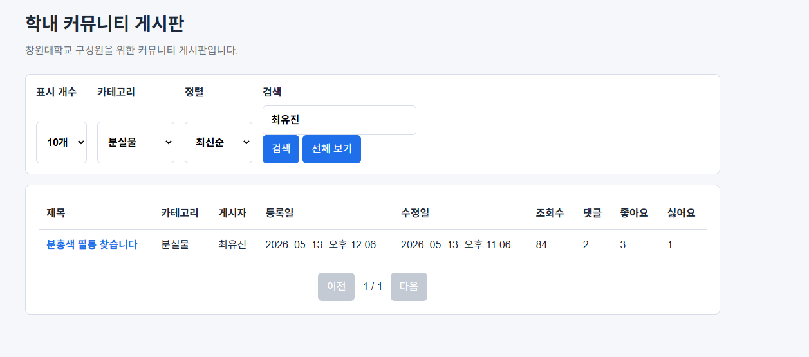 | 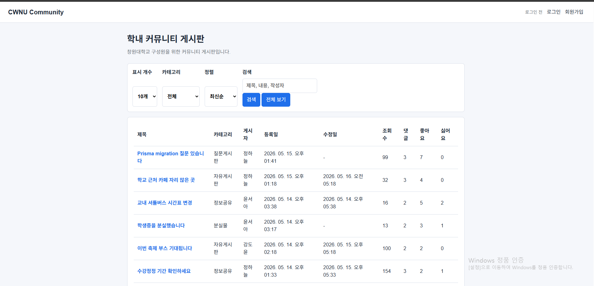 |
|:--:|:--:|
| **▲ 검색 기능** | **▲ 최신순 정렬** |

| 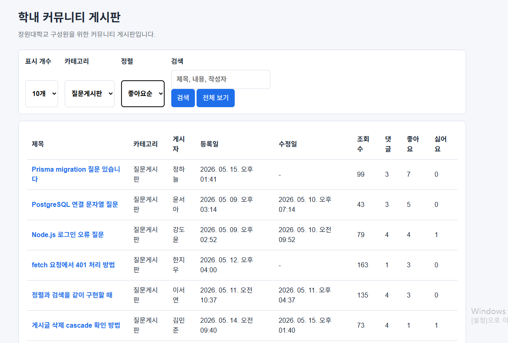 | 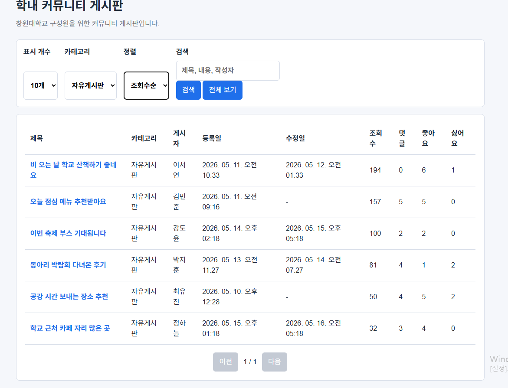 |
|:--:|:--:|
| **▲ 좋아요순 정렬** | **▲ 조회수순 정렬** |

| 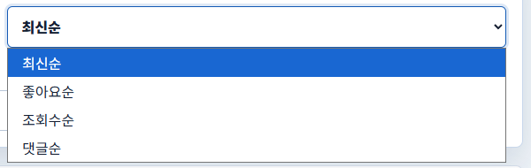 | 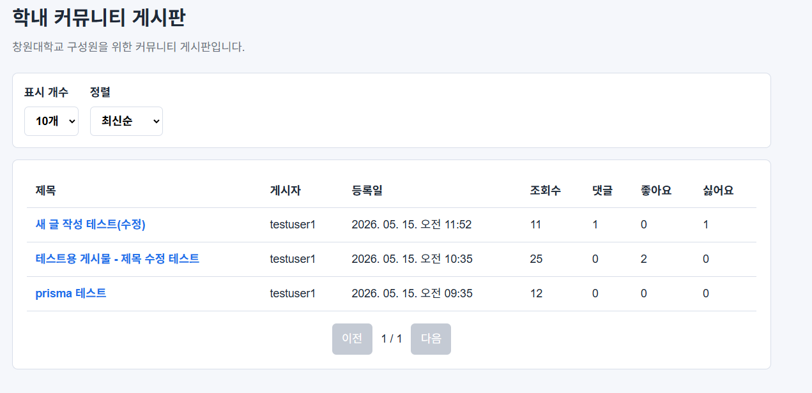 |
|:--:|:--:|
| **▲ 댓글순 정렬** | **▲ 페이징 기능** |

### 검증 내용

- 제목, 내용, 작성자 닉네임 검색이 되는지 확인함.
- 검색 결과가 없을 때 안내 문구 표시 여부 확인.
- 좋아요순, 조회수순, 댓글순 정렬이 실제 count 기준으로 동작 여부 확인.
- pageSize가 10/20/30/40/50 단위로 변경되는지 확인함.

---

## 8. 게시글 작성 / 상세 / 수정 / 삭제

### 기능 설명

로그인 사용자는 게시글을 작성할 수 있으며, 작성자 본인만 수정과 삭제를 할 수 있음.

### 동작 방식

- 글 작성 시 제목, 내용, 카테고리를 입력함.
- 익명 작성 체크 시 목록과 상세 화면의 작성자는 “익명”으로 표시됨.
- 상세 조회 시 조회수가 증가함.
- 작성자 본인에게만 수정/삭제 버튼이 표시됨.
- 서버에서도 현재 로그인 사용자와 게시글 작성자 userId를 비교하여 권한을 검증함.
- 게시글 삭제 시 댓글, 답글, 좋아요, 싫어요, 북마크도 함께 삭제됨.

### 관련 API 또는 DB

| Method | Endpoint | 설명 |
|---|---|---|
| GET | `/api/posts/:id` | 게시글 상세 |
| POST | `/api/posts` | 게시글 작성 |
| PUT | `/api/posts/:id` | 게시글 수정 |
| DELETE | `/api/posts/:id` | 게시글 삭제 |

| DB 모델 | 관련 필드 |
|---|---|
| Post | `title`, `content`, `category`, `isAnonymous`, `viewCount`, `userId`, `createdAt`, `updatedAt` |

### 관련 코드

관련 파일: `server/controllers/post.controller.js`

```js
const post = await prisma.post.create({
  data: {
    title,
    content,
    category,
    isAnonymous,
    userId: req.user.id,
  },
  include: {
    author: { select: { id: true, nickname: true } },
    _count: { select: { comments: true, likes: true, dislikes: true, bookmarks: true } },
  },
});
```

관련 파일: `server/controllers/post.controller.js`

```js
if (existingPost.userId !== req.user.id) {
  return res.status(403).json({ message: "Only the author can update this post." });
}

const post = await prisma.post.update({
  where: { id: postId },
  data: {
    title,
    content,
    category,
    isAnonymous,
  },
});
```

관련 파일: `server/controllers/post.controller.js`

```js
if (post.userId !== req.user.id) {
  return res.status(403).json({ message: "Only the author can delete this post." });
}

await prisma.post.delete({
  where: { id: postId },
});
```

### 관련 화면

- `public/post-write.html`
- `public/post-detail.html`
- `public/index.html`

| 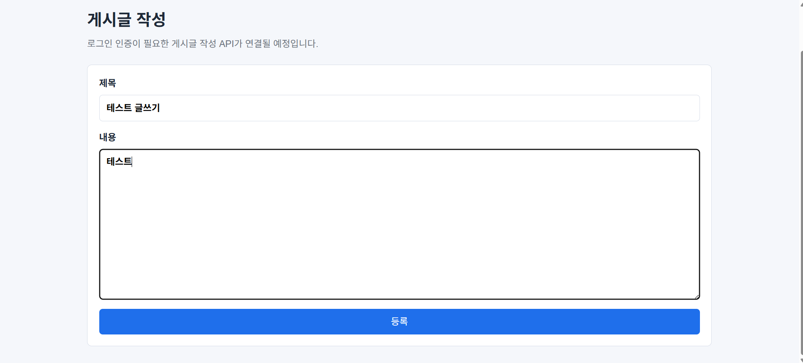 | 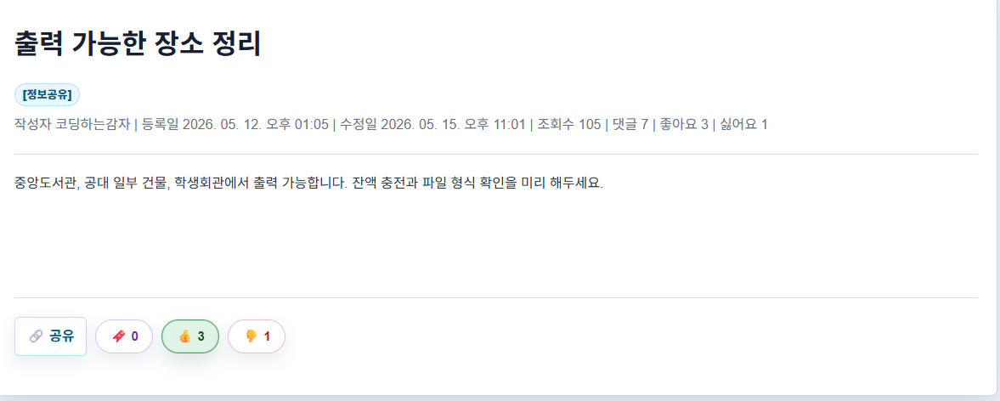 |
|:--:|:--:|
| **▲ 게시글 작성** | **▲ 게시글 상세** |

| 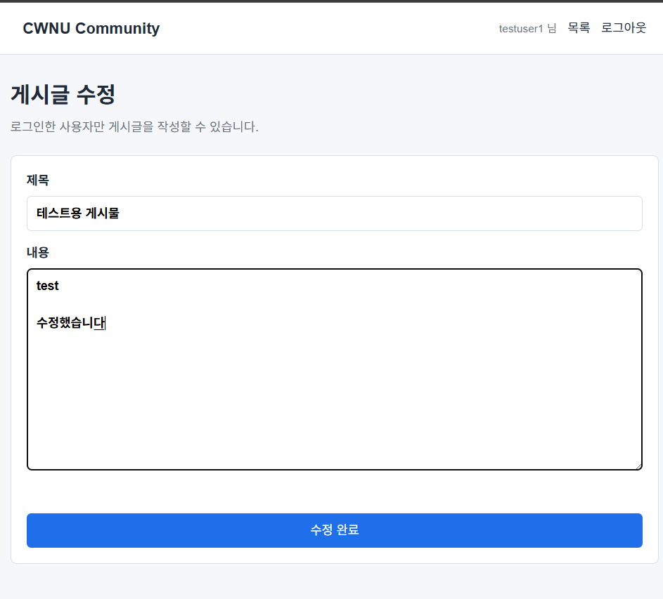 | 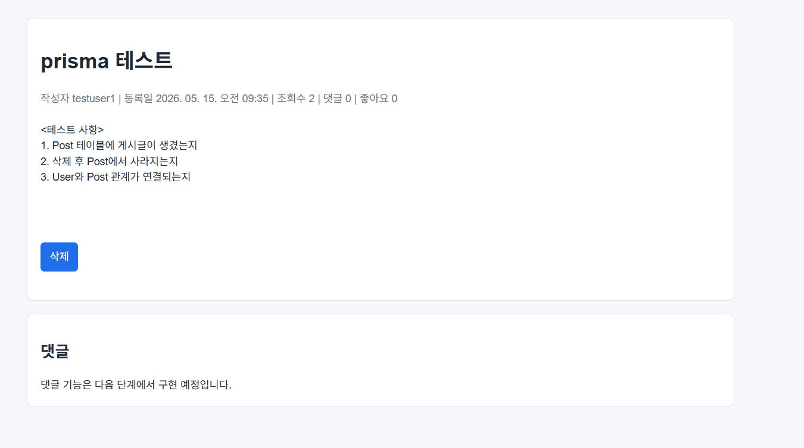 |
|:--:|:--:|
| **▲ 게시글 수정** | **▲ 게시글 삭제** |

|  |
|:--:|
| **▲ 익명 게시글** |

### 검증 내용

- 비로그인 사용자는 글 작성 화면 접근 제한 여부 확인.
- 제목/내용 공백 입력 거부 여부 확인.
- 작성자 본인만 수정/삭제 버튼을 볼 수 있는지 확인함.
- 다른 사용자의 게시글 수정/삭제 요청이 403으로 거부 여부 확인.
- 삭제 후 관련 댓글/답글/반응/북마크가 남지 않는지 확인함.

---

## 9. 댓글 / 답글 / 댓글 수정 / 익명 댓글

### 기능 설명

게시글 상세 화면에서 댓글과 1단계 답글을 작성, 조회, 수정, 삭제할 수 있음. 댓글과 답글 모두 익명 작성이 가능함.

### 동작 방식

- 댓글은 `parentId=null`로 저장됨.
- 답글은 부모 댓글의 id를 `parentId`로 저장함.
- 답글의 답글은 서버에서 400으로 거부함.
- 본인이 작성한 댓글/답글에만 수정/삭제 버튼이 표시됨.
- 익명 댓글/답글은 화면에서 작성자를 “익명”으로 표시함.
- 내부적으로는 `userId`를 유지하여 수정/삭제 권한을 검증함.

### 관련 API 또는 DB

| Method | Endpoint | 설명 |
|---|---|---|
| GET | `/api/posts/:postId/comments` | 댓글/답글 조회 |
| POST | `/api/posts/:postId/comments` | 댓글/답글 작성 |
| PUT | `/api/comments/:id` | 댓글/답글 수정 |
| DELETE | `/api/comments/:id` | 댓글/답글 삭제 |

| DB 모델 | 관련 필드 |
|---|---|
| Comment | `content`, `postId`, `userId`, `parentId`, `isAnonymous`, `createdAt`, `updatedAt` |

### 관련 코드

관련 파일: `server/controllers/comment.controller.js`

```js
if (parentId) {
  const parentComment = await prisma.comment.findUnique({
    where: { id: parentId },
    select: {
      id: true,
      postId: true,
      parentId: true,
    },
  });

  if (parentComment.parentId) {
    return res.status(400).json({ message: "Replies can only be added to top-level comments." });
  }
}
```

관련 파일: `server/controllers/comment.controller.js`

```js
const comment = await prisma.comment.create({
  data: {
    postId,
    userId: req.user.id,
    parentId,
    content,
    isAnonymous,
  },
  include: {
    author: { select: { id: true, nickname: true } },
  },
});
```

관련 파일: `server/controllers/comment.controller.js`

```js
if (existingComment.userId !== req.user.id) {
  return res.status(403).json({ message: "Only the comment author can update this comment." });
}

const comment = await prisma.comment.update({
  where: { id: commentId },
  data: { content },
});
```

### 관련 화면

- `public/post-detail.html`

|  | 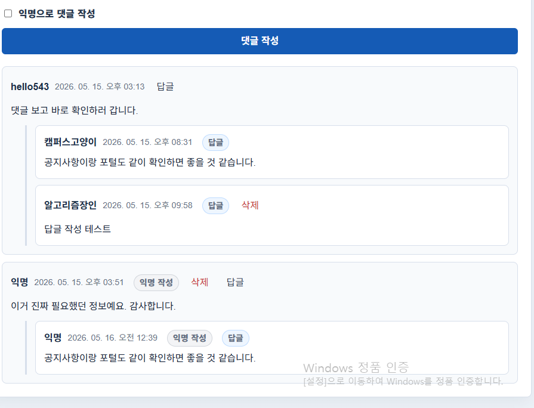 |
|:--:|:--:|
| **▲ 댓글 목록** | **▲ 답글 작성** |

| 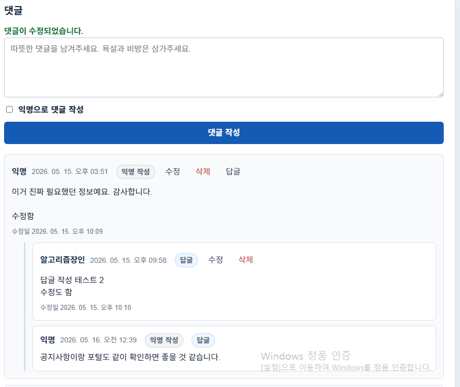 |  |
|:--:|:--:|
| **▲ 댓글 수정** | **▲ 익명 댓글** |

|  |
|:--:|
| **▲ 답글의 답글 제한** |

### 검증 내용

- 댓글 작성 후 목록에 즉시 반영되는지 확인함.
- 답글이 일반 댓글 아래에 들여쓰기 형태로 표시 여부 확인.
- 답글의 답글 작성 시도 거부 여부 확인.
- 본인 댓글/답글만 수정/삭제 가능 여부 확인.
- 익명 댓글/답글 수정 후에도 작성자가 “익명”으로 유지 여부 확인.

---

## 10. 좋아요 / 싫어요 / 북마크

### 기능 설명

로그인 사용자는 게시글에 좋아요, 싫어요, 북마크를 할 수 있음. 좋아요와 싫어요는 동시에 적용되지 않도록 처리함.

### 동작 방식

- 한 사용자는 한 게시글에 좋아요를 한 번만 누를 수 있음.
- 한 사용자는 한 게시글에 싫어요를 한 번만 누를 수 있음.
- 좋아요 상태에서 싫어요를 누르면 좋아요가 삭제되고 싫어요가 생성됨.
- 싫어요 상태에서 좋아요를 누르면 싫어요가 삭제되고 좋아요가 생성됨.
- 북마크는 중복 저장되지 않음.
- 상세 응답에는 현재 사용자의 liked, disliked, bookmarked 상태와 count가 포함됨.

### 관련 API 또는 DB

| Method | Endpoint | 설명 |
|---|---|---|
| POST | `/api/posts/:postId/like` | 좋아요 |
| DELETE | `/api/posts/:postId/like` | 좋아요 취소 |
| POST | `/api/posts/:postId/dislike` | 싫어요 |
| DELETE | `/api/posts/:postId/dislike` | 싫어요 취소 |
| POST | `/api/posts/:postId/bookmark` | 북마크 |
| DELETE | `/api/posts/:postId/bookmark` | 북마크 취소 |

| DB 모델 | 제약 |
|---|---|
| Like | `@@unique([postId, userId])` |
| Dislike | `@@unique([postId, userId])` |
| Bookmark | `@@unique([postId, userId])` |

### 관련 코드

관련 파일: `server/controllers/like.controller.js`

```js
await prisma.$transaction(async (tx) => {
  await tx.dislike.deleteMany({
    where: {
      postId,
      userId: req.user.id,
    },
  });

  await tx.like.upsert({
    where: { postId_userId: { postId, userId: req.user.id } },
    update: {},
    create: { postId, userId: req.user.id },
  });
});
```

관련 파일: `server/controllers/dislike.controller.js`

```js
await prisma.$transaction(async (tx) => {
  await tx.like.deleteMany({
    where: {
      postId,
      userId: req.user.id,
    },
  });

  await tx.dislike.upsert({
    where: { postId_userId: { postId, userId: req.user.id } },
    update: {},
    create: { postId, userId: req.user.id },
  });
});
```

관련 파일: `server/controllers/bookmark.controller.js`

```js
await prisma.bookmark.upsert({
  where: {
    postId_userId: {
      postId,
      userId: req.user.id,
    },
  },
  update: {},
  create: {
    postId,
    userId: req.user.id,
  },
});
```

### 관련 화면

- `public/post-detail.html`
- `public/index.html`
- `public/mypage.html`

| 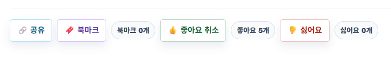 | 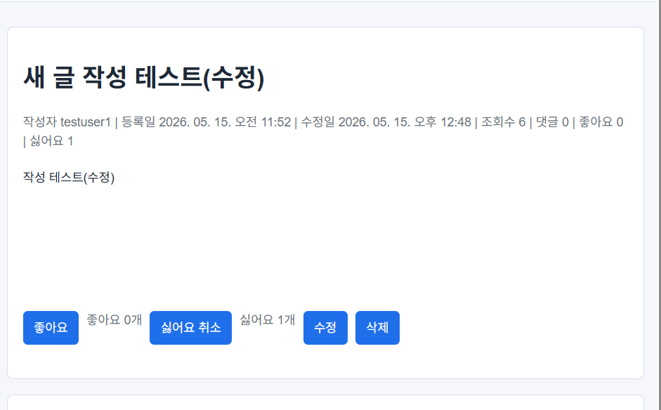 |
|:--:|:--:|
| **▲ 좋아요 싫어요 북마크** | **▲ 좋아요 싫어요 전환** |

|  |
|:--:|
| **▲ 북마크 목록** |

### 검증 내용

- 좋아요/싫어요/북마크 버튼 클릭 시 count와 상태가 갱신되는지 확인함.
- 좋아요와 싫어요가 동시에 적용되지 않는지 확인함.
- 같은 게시글에 중복 좋아요/북마크가 생성되지 않는지 확인함.
- 비로그인 사용자는 반응 기능 사용 제한 여부 확인.

---

## 11. 마이페이지

### 기능 설명

마이페이지에서는 로그인 사용자의 계정 정보와 활동 내역을 확인할 수 있음.

### 동작 방식

- 비로그인 사용자가 접근하면 로그인 안내 또는 로그인 페이지 이동 처리를 함.
- 로그인 사용자는 내 정보, 작성한 글, 작성한 댓글/답글, 좋아요, 싫어요, 북마크 목록을 확인함.
- 작성한 글 목록은 카테고리 필터를 지원함.
- 닉네임 변경과 회원 탈퇴도 마이페이지에서 수행함.

### 관련 API 또는 DB

| Method | Endpoint | 설명 |
|---|---|---|
| GET | `/api/auth/me/activity` | 현재 사용자 활동 조회 |
| PATCH | `/api/auth/me` | 닉네임 변경 |
| DELETE | `/api/auth/me` | 회원 탈퇴 |

| DB 모델 | 표시 데이터 |
|---|---|
| User | 닉네임, 이메일, 가입일 |
| Post | 내가 작성한 게시글 |
| Comment | 내가 작성한 댓글/답글 |
| Like/Dislike/Bookmark | 내가 반응한 게시글 |

### 관련 코드

관련 파일: `server/controllers/auth.controller.js`

```js
const [user, posts, comments, likes, dislikes, bookmarks] = await Promise.all([
  prisma.user.findUnique({
    where: { id: userId },
    select: {
      id: true,
      email: true,
      nickname: true,
      createdAt: true,
    },
  }),
  prisma.post.findMany({
    where: { userId },
    orderBy: { createdAt: "desc" },
    select: {
      id: true,
      title: true,
      category: true,
      isAnonymous: true,
      createdAt: true,
      updatedAt: true,
      viewCount: true,
    },
  }),
]);
```

관련 파일: `public/js/mypage.js`

```js
async function loadMyPage() {
  try {
    const activity = await api.request("/api/auth/me/activity");

    myPageState.posts = activity.posts;
    renderProfile(activity.user);
    renderMyPosts(myPageState.posts);
    renderComments(activity.comments);
    renderReactions("#my-likes", "#my-likes-panel", activity.likes, "좋아요 누른 게시글이 없습니다.", "좋아요");
    renderReactions("#my-dislikes", "#my-dislikes-panel", activity.dislikes, "싫어요 누른 게시글이 없습니다.", "싫어요");
    renderBookmarks(activity.bookmarks || []);
  } catch (error) {
    setMyPageMessage("마이페이지를 보려면 로그인하세요.", "error");
  }
}
```

### 관련 화면

- `public/mypage.html`

| 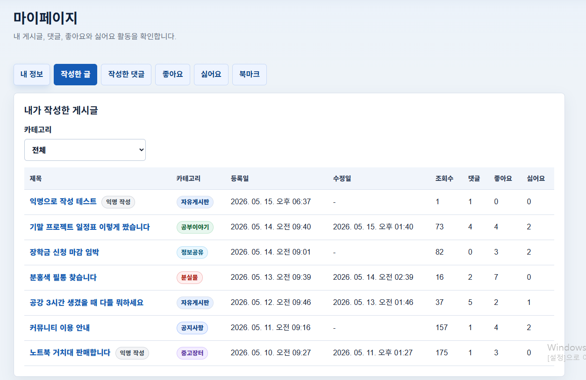 | 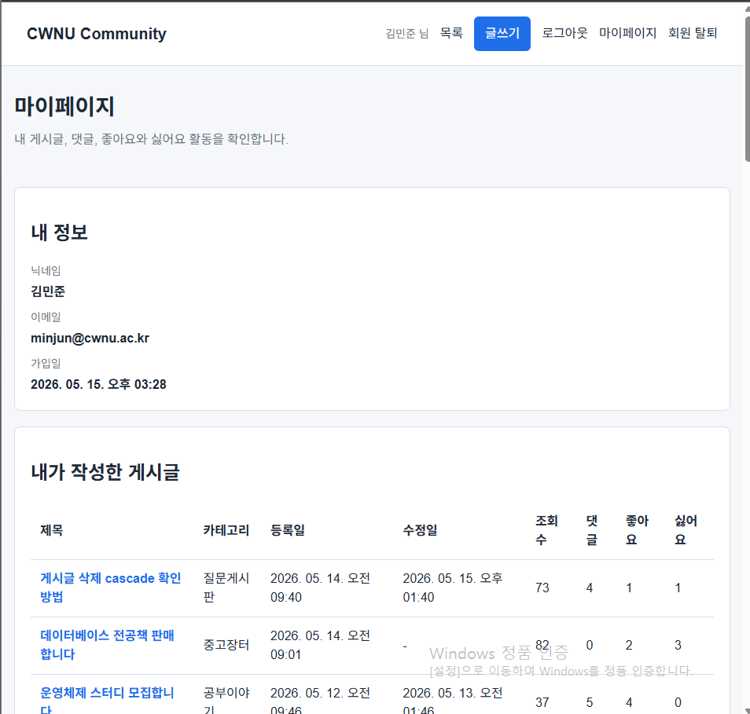 |
|:--:|:--:|
| **▲ 마이페이지 내 정보** | **▲ 마이페이지 작성 글** |

| 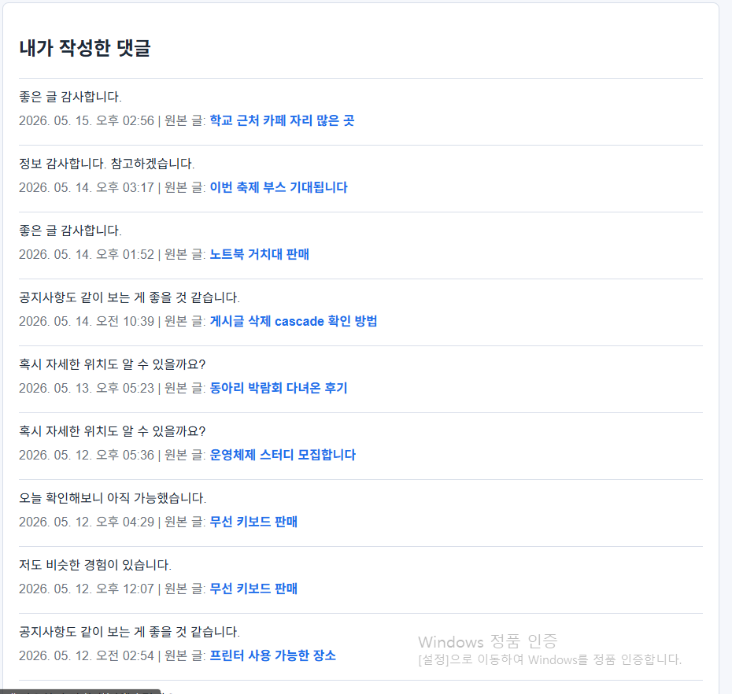 | 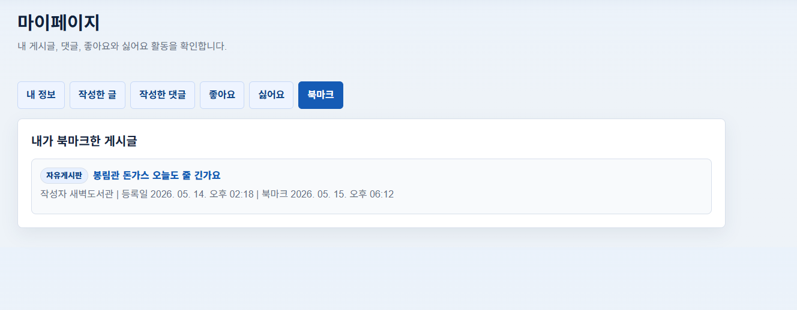 |
|:--:|:--:|
| **▲ 마이페이지 댓글** | **▲ 마이페이지 북마크** |

### 검증 내용

- 로그인 후 마이페이지 접근 가능 여부 확인.
- 비로그인 상태에서 마이페이지 접근 제한 여부 확인.
- 작성한 글, 댓글, 좋아요, 싫어요, 북마크 목록 표시 여부 확인.
- 닉네임 변경 후 헤더와 마이페이지 정보가 갱신되는지 확인함.

---

## 12. 공유 링크

### 기능 설명

게시글 상세 화면에서 현재 게시글 URL을 클립보드에 복사할 수 있음.

### 동작 방식

- 공유 버튼을 클릭하면 현재 origin과 게시글 id를 조합함.
- 복사 형식은 `/post-detail.html?id=게시글ID`임.
- `navigator.clipboard`를 우선 사용하고 실패 시 fallback 처리를 함.
- 비로그인 사용자도 공유 기능을 사용할 수 있음.

### 관련 API 또는 DB

- 별도 DB 저장 없음
- 별도 API 호출 없음
- 클라이언트에서 현재 URL 기준으로 링크 생성

### 관련 코드

관련 파일: `public/js/posts.js`

```js
function bindShareButton(post) {
  const shareButton = document.querySelector("#share-post-button");

  if (!shareButton) {
    return;
  }

  shareButton.addEventListener("click", async () => {
    shareButton.disabled = true;

    try {
      const copied = await copyText(getShareUrl(post.id));
      setPostMessage(copied ? "게시글 링크가 복사되었습니다." : "링크 복사에 실패했습니다.", copied ? "success" : "error");
    } catch (error) {
      setPostMessage("링크 복사에 실패했습니다.", "error");
    } finally {
      shareButton.disabled = false;
    }
  });
}
```

### 관련 화면

- `public/post-detail.html`

| 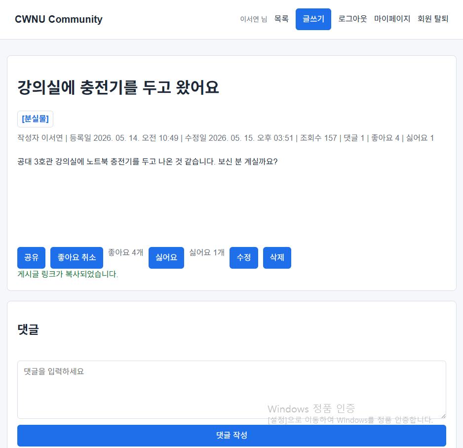 |
|:--:|
| **▲ 게시글 공유** |

### 검증 내용

- 공유 버튼 클릭 시 공유 성공 메시지 표시 여부 확인.
- 복사된 링크를 새 탭에 붙여넣으면 같은 게시글 상세 화면이 열리는지 확인함.
- 비로그인 상태에서도 공유 버튼 동작 여부 확인.

---

## 13. 도움말 투어

### 기능 설명

메인 게시판 페이지에는 주요 기능을 단계별로 설명하는 도움말 투어가 있음.

### 동작 방식

- 도움말 버튼 클릭 시 overlay와 안내 팝업이 표시됨.
- 게시판 바로가기, 표시 개수, 정렬, 검색, 게시글 목록, 글쓰기, 다크모드, 마이페이지 기능을 순서대로 안내함.
- 요소가 없으면 해당 단계를 건너뛰거나 로그인 후 사용 가능 문구로 처리함.
- ESC 키 또는 완료/건너뛰기 버튼으로 종료할 수 있음.

### 관련 API 또는 DB

- 별도 DB 저장 없음
- 별도 API 호출 없음
- `public/js/posts.js`와 CSS로 클라이언트 UI 처리

### 관련 코드

관련 파일: `public/js/posts.js`

```js
const GUIDE_STEP_DEFINITIONS = [
  {
    selector: ".board-shortcuts",
    title: "게시판 바로가기",
    description: "인기글, 공지사항, 전체글과 카테고리 게시판으로 바로 이동할 수 있습니다.",
  },
  {
    selector: "#page-size",
    title: "표시 개수",
    description: "한 페이지에 10, 20, 30, 40, 50개 단위로 게시글을 볼 수 있습니다.",
  },
  {
    selector: "#sort",
    title: "정렬",
    description: "최신순, 좋아요순, 조회수순, 댓글순으로 게시글 목록을 정렬할 수 있습니다.",
  },
];
```

관련 파일: `public/js/posts.js`

```js
guideState.keydownHandler = (event) => {
  if (event.key === "Escape") {
    endGuideTour();
  }
};

step.element.scrollIntoView({
  behavior: window.matchMedia("(prefers-reduced-motion: reduce)").matches ? "auto" : "smooth",
  block: "center",
  inline: "nearest",
});
```

### 관련 화면

- `public/index.html`

|  |
|:--:|
| **▲ 도움말 투어** |

### 검증 내용

- 도움말 버튼 클릭 시 투어가 시작되는지 확인함.
- 다음/이전/건너뛰기/완료 버튼 동작 여부 확인.
- ESC 키로 투어가 종료되는지 확인함.
- 다크모드에서도 overlay와 팝업 가독성 확인.

---

## 14. 다크모드 / UI 개선

### 기능 설명

전체 주요 페이지에서 라이트/다크모드 전환과 hover 인터랙션을 지원함. footer에는 과제 정보와 GitHub 링크를 제공함.

### 동작 방식

- 테마는 `data-theme` 속성과 CSS 변수로 적용함.
- 사용자가 선택한 테마는 localStorage에 저장됨.
- 버튼, 카드, 게시판 바로가기, 링크에는 hover/active 효과가 적용됨.
- 주요 페이지 하단에는 과제 정보와 GitHub 링크가 표시됨.

### 관련 API 또는 DB

- 별도 DB 저장 없음
- localStorage key: `cwnu-community-theme`

### 관련 코드

관련 파일: `public/js/auth.js`

```js
function applyTheme(theme) {
  const normalizedTheme = theme === "dark" ? "dark" : "light";
  const isDark = normalizedTheme === "dark";

  document.documentElement.dataset.theme = normalizedTheme;

  const themeToggleButton = document.querySelector("#theme-toggle-button");
  if (themeToggleButton) {
    themeToggleButton.textContent = isDark ? "\uB77C\uC774\uD2B8\uBAA8\uB4DC" : "\uB2E4\uD06C\uBAA8\uB4DC";
    themeToggleButton.setAttribute("aria-pressed", String(isDark));
    themeToggleButton.title = isDark ? "\uB77C\uC774\uD2B8\uBAA8\uB4DC\uB85C \uC804\uD658" : "\uB2E4\uD06C\uBAA8\uB4DC\uB85C \uC804\uD658";
  }
}
```

관련 파일: `public/css/style.css`

```css
:root {
  --bg: #eef3f8;
  --surface: #ffffff;
  --text: #172033;
  --primary: #155bb5;
  --motion-fast: 160ms ease;
}

html[data-theme="dark"] {
  --bg: #101827;
  --surface: #182236;
  --text: #edf3fb;
  --primary: #5b9dff;
}
```

### 관련 화면

- `public/index.html`
- `public/login.html`
- `public/register.html`
- `public/post-write.html`
- `public/post-detail.html`
- `public/mypage.html`

|  | 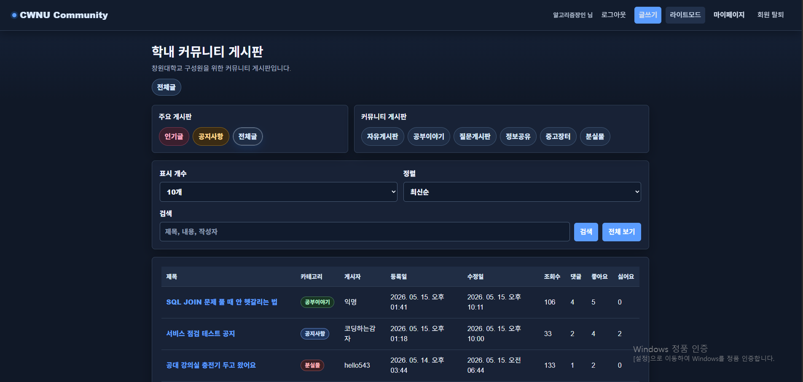 |
|:--:|:--:|
| **▲ 라이트모드 대표 화면** | **▲ 다크모드** |

|  |
|:--:|
| **▲ footer** |

### 검증 내용

- 각 페이지에서 테마 전환 버튼이 보이는지 확인함.
- 새로고침 후에도 선택한 테마 유지 여부 확인.
- 다크모드에서 텍스트, 버튼, 테이블, footer 가독성 확인.
- hover 효과가 레이아웃을 깨지 않는지 확인함.

---

## 15. 개발용 seed 데이터

### 기능 설명

개발 및 기능 설명서 캡처를 위해 테스트 데이터를 자동 생성하는 seed 스크립트를 제공함.

### 동작 방식

- 실행 시 기존 데이터를 삭제한 뒤 새 더미 데이터를 생성함.
- 삭제 순서는 외래키 관계를 고려함.
- `NODE_ENV=production`이면 실행을 중단함.
- `--confirm` 인자가 없으면 실행을 중단함.
- 테스트 계정의 비밀번호는 모두 `test1234!`임.

### 관련 API 또는 DB

| 파일 | 설명 |
|---|---|
| `scripts/seed-dev.js` | 개발용 데이터 초기화/생성 |
| User | 테스트 사용자 |
| Post | 카테고리별 게시글 |
| Comment | 댓글/답글 |
| Like/Dislike/Bookmark | 반응 데이터 |

### 관련 코드

관련 파일: `scripts/seed-dev.js`

```js
function assertSafeToRun() {
  if (process.env.NODE_ENV === "production") {
    console.error("Refusing to seed development data while NODE_ENV is production.");
    process.exit(1);
  }

  if (!process.argv.includes("--confirm")) {
    console.error("This script deletes existing data before seeding.");
    console.error("Run with: npm run db:seed:dev -- --confirm");
    process.exit(1);
  }
}
```

관련 파일: `scripts/seed-dev.js`

```js
const PASSWORD = "test1234!";
const SALT_ROUNDS = 12;

const users = [
  { email: "algo@cwnu.ac.kr", nickname: "알고리즘장인" },
  { email: "campuscat@cwnu.ac.kr", nickname: "캠퍼스고양이" },
  { email: "assignment@cwnu.ac.kr", nickname: "과제폭격기" },
  { email: "dbmaster@cwnu.ac.kr", nickname: "DB마스터" },
];
```

### 관련 화면

- seed 실행 후 전체 UI 화면
- Prisma Studio 데이터 확인 화면

|  |
|:--:|
| **▲ seed 데이터 목록** |

### 검증 내용

- `node --check scripts/seed-dev.js`가 통과하는지 확인함.
- `npm run db:seed:dev -- --confirm` 실행 후 데이터 생성 여부 확인.
- production 환경에서는 실행이 차단되는지 확인함.
- 메인 목록과 카테고리별 게시글이 정상 표시 여부 확인.

---

## 16. DB cascade 삭제 검증

### 기능 설명

게시글 삭제와 회원 탈퇴 시 연결된 데이터가 남지 않도록 cascade 삭제를 검증함.

### 동작 방식

- Post 삭제 시 Comment, Like, Dislike, Bookmark가 함께 삭제됨.
- User 삭제 시 해당 사용자가 작성한 Post, Comment와 반응 데이터가 삭제됨.
- 부모 댓글 삭제 시 연결된 답글도 삭제됨.
- 회원 탈퇴는 현재 로그인 사용자 기준으로 처리하며 프론트에서 userId를 받지 않음.

### 관련 API 또는 DB

| 삭제 상황 | 관련 API | 관련 DB |
|---|---|---|
| 게시글 삭제 | `DELETE /api/posts/:id` | Post, Comment, Like, Dislike, Bookmark |
| 회원 탈퇴 | `DELETE /api/auth/me` | User, Post, Comment, Like, Dislike, Bookmark |
| 댓글 삭제 | `DELETE /api/comments/:id` | Comment self relation |

### 관련 코드

관련 파일: `prisma/schema.prisma`

```prisma
model Comment {
  id       Int      @id @default(autoincrement())
  postId   Int      @map("post_id")
  userId   Int      @map("user_id")
  parentId Int?     @map("parent_id")
  post     Post     @relation(fields: [postId], references: [id], onDelete: Cascade)
  author   User     @relation(fields: [userId], references: [id], onDelete: Cascade)
  parent   Comment? @relation("CommentReplies", fields: [parentId], references: [id], onDelete: Cascade)
  replies  Comment[] @relation("CommentReplies")
}
```

관련 파일: `server/controllers/post.controller.js`

```js
await prisma.post.delete({
  where: { id: postId },
});
```

관련 파일: `server/controllers/auth.controller.js`

```js
await prisma.$transaction(async (tx) => {
  await tx.post.deleteMany({ where: { userId } });
  await tx.comment.deleteMany({ where: { userId } });
  await tx.like.deleteMany({ where: { userId } });
  await tx.dislike.deleteMany({ where: { userId } });
  await tx.bookmark.deleteMany({ where: { userId } });
  await tx.user.delete({ where: { id: userId } });
});
```

### 관련 화면

- 게시글 상세 화면
- 마이페이지 회원 탈퇴 영역
- Prisma Studio

|  |  |
|:--:|:--:|
| **▲ 게시글 삭제 전후 DB** | **▲ 회원 탈퇴 전후 DB** |

### 검증 내용

- 게시글 삭제 후 해당 게시글의 댓글/답글/좋아요/싫어요/북마크가 남지 않는지 확인함.
- 회원 탈퇴 후 사용자의 게시글/댓글/반응/북마크 삭제 여부 확인.
- 다른 사용자의 게시글은 회원 탈퇴 후에도 유지 여부 확인.
- 부모 댓글 삭제 후 답글 함께 삭제 여부 확인.

---

## 17. AI 활용 명시

### 기능 설명

프로젝트 구현 및 문서 정리 과정에서 AI 도구를 활용함. 과제 제출 시 AI 활용 사실과 활용 범위를 명시함.

### 동작 방식

- 구현 전략 수립과 코드 작성 보조에 AI를 활용함.
- UI/UX 개선, 오류 분석, README 정리, 테스트 체크리스트 작성에 AI를 활용함.
- 최종 기능 동작과 제출 문서는 제출자가 직접 검토함.

### 관련 API 또는 DB

- 관련 API 없음
- 관련 DB 없음

### 관련 화면

- README 부록의 AI 활용 명시
- 별도 문서 작성 시 `docs/ai-usage.md`

별도 화면 캡처 없음. AI 활용 사실은 README 부록과 `docs/ai-usage.md` 문서로 제출함.

### 검증 내용

- README에 AI 활용 도구와 활용 범위가 명시되어 있는지 확인함.
- 실제 프롬프트 전문이나 민감정보를 임의로 작성하지 않았는지 확인함.
- AI 결과물을 제출자가 검토했다는 점이 문서에 포함되어 있는지 확인함.

---

## 18. 결론

### 기능 설명

본 프로젝트는 데이터베이스개론 과제 요구사항을 충족하는 Node.js 기반 DBMS 웹 게시판임. 필수 기능 외에도 카테고리, 공지사항, 인기글, 댓글 답글, 익명 작성, 북마크, 마이페이지, 다크모드, 도움말 투어 등을 추가하여 실제 커뮤니티 서비스에 가까운 형태로 확장함.

### 동작 방식

- 프론트엔드는 정적 HTML/CSS/Vanilla JS로 구성함.
- 서버는 Express REST API로 구성함.
- 데이터는 PostgreSQL과 Prisma ORM으로 관리함.
- 인증은 JWT httpOnly cookie로 유지함.
- 배포는 Vercel 서버리스 Express 구조를 고려함.

### 관련 API 또는 DB

- 전체 API: `server/routes/`
- 전체 DB 모델: `prisma/schema.prisma`
- 환경변수 예시: `.env.example`
- 배포 설정: `vercel.json`, `api/index.js`

### 관련 화면

- 전체 주요 페이지
- 기능 설명서용 최종 캡처 화면

|  |  |
|:--:|:--:|
| **▲ 최종 메인 화면** | **▲ 최종 상세 화면** |

|  |
|:--:|
| **▲ 최종 마이페이지** |

### 검증 내용

- 과제 필수 기능이 모두 동작 여부 확인.
- 게시글 삭제와 회원 탈퇴 시 cascade 삭제가 정상 동작 여부 확인.
- 로그인, 권한 검증, 익명 표시, 반응 전환이 정상 동작 여부 확인.
- README와 기능 설명서의 기능 설명이 실제 구현과 충돌하지 않는지 확인함.

